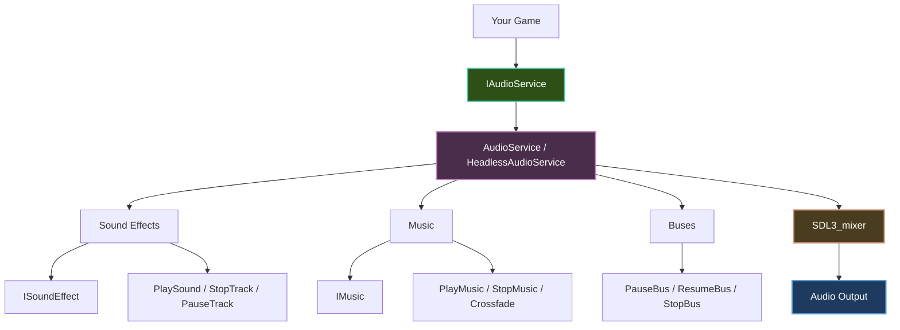
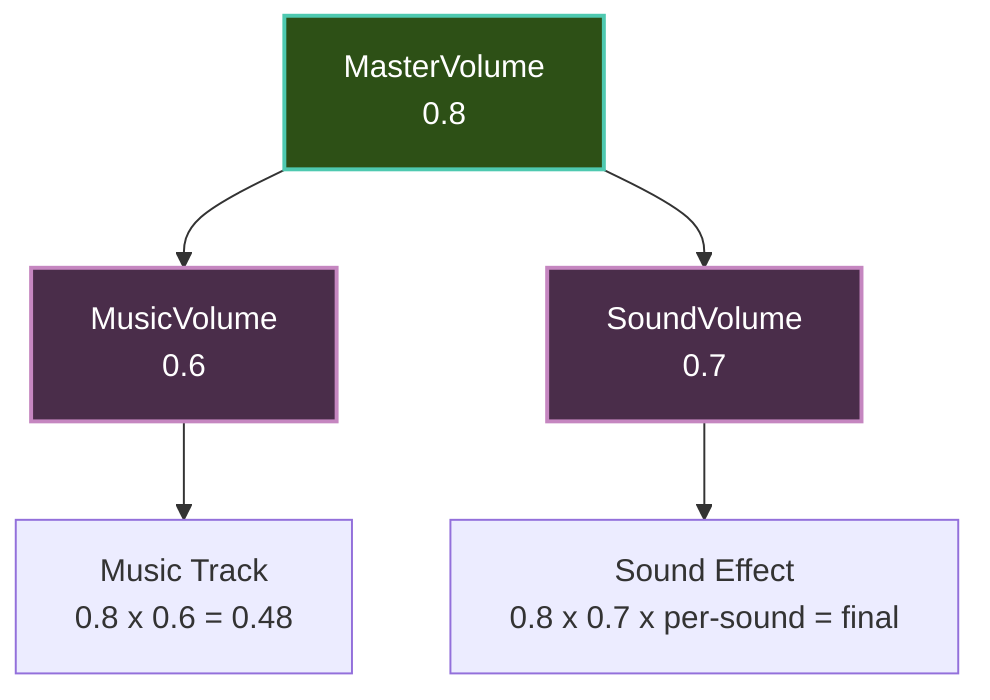

# Audio Getting Started

Learn how to add sound effects, music, and audio to your Brine2D games.

## Overview

Brine2D's audio system provides:

- **Sound Effects** — Short audio clips (explosions, jumps, shots)
- **Music** — Long-form background audio (looping tracks, crossfade)
- **Volume Control** — Master, music, and sound volume channels
- **Track Management** — Control individual playing sounds (pause, resume, stop, volume, pan, pitch)
- **Bus System** — Group tracks for batch operations (pause/stop/volume by bus)
- **Spatial Audio** — ECS-based positional sound via `SoundEffectSourceComponent`
- **Priority Eviction** — Lowest-priority tracks evicted when all tracks are in use

**Powered by:** SDL3_mixer (high-quality audio mixing)

**Supported formats:**

- WAV, MP3, OGG, FLAC (sound effects)
- MP3, OGG (music streaming)

---

## Audio Architecture



**Interface hierarchy:**

| Interface | Responsibility |
|-----------|---------------|
| `ISoundLoader` | `GetOrLoadSoundAsync` |
| `IMusicLoader` | `GetOrLoadMusicAsync` |
| `IAudioPlayer` | Playback, volume, track control, buses |
| `IAudioService` | Composite: all of the above |

The `Audio` property on `Scene` is `IAudioService`. Prefer the narrower interfaces when injecting into your own services.

---

## Setup

### Step 1: No Extra Registration Needed

Audio is included automatically when you call `GameApplication.CreateBuilder()`. No separate registration step is required.

```csharp
var builder = GameApplication.CreateBuilder(args);

builder.Configure(options =>
{
    options.Window.Title = "Audio Demo";
    options.Window.Width = 800;
    options.Window.Height = 600;
});

builder.AddScene<GameScene>();

await using var game = builder.Build();
await game.RunAsync<GameScene>();
```

---

### Step 2: Use the Audio Property or Inject Loaders

In your scene, use the built-in `Audio` property (no constructor injection needed), or inject `ISoundLoader` / `IMusicLoader` for loading:

```csharp
using Brine2D.Audio;
using Brine2D.Core;
using Brine2D.Engine;

public class GameScene : Scene
{
    private readonly ISoundLoader _soundLoader;
    private readonly IMusicLoader _musicLoader;

    public GameScene(ISoundLoader soundLoader, IMusicLoader musicLoader)
    {
        _soundLoader = soundLoader;
        _musicLoader = musicLoader;
    }
}
```

---

## Loading Audio

### Load Sound Effects

```csharp
private ISoundEffect? _jumpSound;
private ISoundEffect? _shootSound;
private ISoundEffect? _explosionSound;

protected override async Task OnLoadAsync(CancellationToken ct, IProgress<float>? progress = null)
{
    _jumpSound = await _soundLoader.GetOrLoadSoundAsync("assets/sounds/jump.wav", ct);
    _shootSound = await _soundLoader.GetOrLoadSoundAsync("assets/sounds/shoot.wav", ct);
    _explosionSound = await _soundLoader.GetOrLoadSoundAsync("assets/sounds/explosion.wav", ct);

    Logger.LogInformation("Sound effects loaded");
}
```

All calls share a thread-safe cache — loading the same path twice returns the cached instance.

**When to use:** Short duration (< 5 seconds), played frequently, may play simultaneously.

---

### Load Music

```csharp
private IMusic? _backgroundMusic;
private IMusic? _bossMusic;

protected override async Task OnLoadAsync(CancellationToken ct, IProgress<float>? progress = null)
{
    _backgroundMusic = await _musicLoader.GetOrLoadMusicAsync("assets/music/background.ogg", ct);
    _bossMusic = await _musicLoader.GetOrLoadMusicAsync("assets/music/boss.ogg", ct);
}
```

**When to use:** Long duration (> 30 seconds), background music, only one track at a time, streamed from disk.

---

## Playing Audio

### Play Sound Effects

Simple playback:

```csharp
protected override void OnUpdate(GameTime gameTime)
{
    if (Input.IsKeyPressed(Key.Space))
        Audio.PlaySound(_jumpSound!);

    if (Input.IsKeyPressed(Key.X))
        Audio.PlaySound(_shootSound!, volume: 0.5f);
}
```

**With full options:**

```csharp
// Volume, loops, pan, pitch, priority, bus
nint track = Audio.PlaySound(_explosionSound!,
    volume: 0.7f,
    loops: 0,
    pan: -0.5f,
    pitch: 1.2f,
    priority: 5,
    bus: "sfx");
```

---

### Play Music

```csharp
// Loop infinitely
Audio.PlayMusic(_backgroundMusic!, loops: -1);

// Play once
Audio.PlayMusic(_backgroundMusic!, loops: 0);

// With loop start point (intro then loop)
Audio.PlayMusic(_backgroundMusic!, loops: -1, loopStartMs: 5000);

// Pause / resume / stop
Audio.PauseMusic();
Audio.ResumeMusic();
Audio.StopMusic();

// Stop with fade-out
Audio.StopMusic(fadeDuration: 2.0f);
```

---

### Crossfade Music

```csharp
// Crossfade from current track to boss music over 1.5 seconds
Audio.CrossfadeMusic(_bossMusic!, fadeDuration: 1.5f, loops: -1);
```

---

## Audio Tracks

`PlaySound` always returns a track handle (`nint`) for lifecycle control:

```csharp
nint track = Audio.PlaySound(_engineSound!, volume: 0.5f, loops: -1);

// Control the track
Audio.SetTrackVolume(track, 0.3f);
Audio.SetTrackPan(track, 0.5f);
Audio.SetTrackPitch(track, 0.8f);
Audio.PauseTrack(track);
Audio.ResumeTrack(track);
Audio.StopTrack(track);

// Check if still playing
if (Audio.IsTrackAlive(track))
    Logger.LogInformation("Still playing");
```

Returns `nint.Zero` if the sound could not be played (all tracks full and priority too low).

---

### Managing Multiple Sounds

```csharp
public class AudioController
{
    private readonly IAudioPlayer _audio;
    private readonly List<nint> _activeTracks = new();

    public AudioController(IAudioPlayer audio) => _audio = audio;

    public void PlayAndTrack(ISoundEffect sound, float volume = 1.0f)
    {
        nint track = _audio.PlaySound(sound, volume: volume);
        if (track != nint.Zero)
            _activeTracks.Add(track);
    }

    public void CleanupFinished()
    {
        _activeTracks.RemoveAll(t => !_audio.IsTrackAlive(t));
    }

    public void StopAllTracked()
    {
        foreach (var track in _activeTracks)
            _audio.StopTrack(track);
        _activeTracks.Clear();
    }
}
```

---

### Looping Sounds

```csharp
public class EngineSound
{
    private readonly IAudioPlayer _audio;
    private readonly ISoundEffect _engineSound;
    private nint _engineTrack;

    public EngineSound(IAudioPlayer audio, ISoundEffect engineSound)
    {
        _audio = audio;
        _engineSound = engineSound;
    }

    public void StartEngine()
    {
        _engineTrack = _audio.PlaySound(_engineSound, volume: 0.5f, loops: -1);
    }

    public void StopEngine()
    {
        if (_engineTrack != nint.Zero)
        {
            _audio.StopTrack(_engineTrack);
            _engineTrack = nint.Zero;
        }
    }

    public void UpdateEngineVolume(float volume)
    {
        if (_audio.IsTrackAlive(_engineTrack))
            _audio.SetTrackVolume(_engineTrack, volume);
    }
}
```

---

## Volume Control

### Master Volume

Controls all audio:

```csharp
Audio.MasterVolume = 0.8f;
Audio.MasterVolume = 0.0f; // Mute all
```

---

### Music Volume

Controls only music:

```csharp
Audio.MusicVolume = 0.6f;
```

---

### Sound Volume

Controls only sound effects:

```csharp
Audio.SoundVolume = 0.7f;
```

---

### Per-Track Music Volume

```csharp
// Reduce the current music track's volume independently
Audio.SetMusicTrackVolume(0.5f);
// Final gain = MusicVolume x track volume
```

---

### Volume Hierarchy



**Formula:** `Final = MasterVolume x (MusicVolume or SoundVolume) x per-track volume`

---

## Bus System

Group tracks by purpose for batch control:

```csharp
// Play with bus tag
nint track = Audio.PlaySound(_uiClick!, bus: "ui");

// Or tag after creation
Audio.TagTrack(track, "dialog");

// Batch operations
Audio.PauseBus("sfx");
Audio.ResumeBus("sfx");
Audio.StopBus("ui");
Audio.SetBusVolume("sfx", 0.5f);
```

Default bus names: `"sfx"` for sound effects, `"music"` for music components.

---

## Complete Example

```csharp
using Brine2D.Audio;
using Brine2D.Core;
using Brine2D.Engine;
using Brine2D.Input;

public class AudioDemoScene : Scene
{
    private readonly ISoundLoader _soundLoader;
    private readonly IMusicLoader _musicLoader;

    private ISoundEffect? _jumpSound;
    private ISoundEffect? _hitSound;
    private IMusic? _backgroundMusic;

    private nint _loopingTrack;

    public AudioDemoScene(ISoundLoader soundLoader, IMusicLoader musicLoader)
    {
        _soundLoader = soundLoader;
        _musicLoader = musicLoader;
    }

    protected override async Task OnLoadAsync(CancellationToken ct, IProgress<float>? progress = null)
    {
        _jumpSound = await _soundLoader.GetOrLoadSoundAsync("assets/sounds/jump.wav", ct);
        _hitSound = await _soundLoader.GetOrLoadSoundAsync("assets/sounds/hit.wav", ct);
        _backgroundMusic = await _musicLoader.GetOrLoadMusicAsync("assets/music/background.ogg", ct);

        Audio.MasterVolume = 0.8f;
        Audio.MusicVolume = 0.6f;
        Audio.SoundVolume = 0.7f;

        Audio.PlayMusic(_backgroundMusic, loops: -1);
    }

    protected override void OnUpdate(GameTime gameTime)
    {
        if (Input.IsKeyPressed(Key.Space))
            Audio.PlaySound(_jumpSound!);

        if (Input.IsKeyPressed(Key.X))
            Audio.PlaySound(_hitSound!, volume: 0.5f);

        if (Input.IsKeyPressed(Key.L))
        {
            if (_loopingTrack == nint.Zero || !Audio.IsTrackAlive(_loopingTrack))
            {
                _loopingTrack = Audio.PlaySound(_hitSound!, loops: -1, volume: 0.3f);
            }
            else
            {
                Audio.StopTrack(_loopingTrack);
                _loopingTrack = nint.Zero;
            }
        }

        if (Input.IsKeyPressed(Key.M))
        {
            if (Audio.IsMusicPaused)
                Audio.ResumeMusic();
            else
                Audio.PauseMusic();
        }

        if (Input.IsKeyDown(Key.Up))
            Audio.MasterVolume = Math.Min(Audio.MasterVolume + 0.01f, 1.0f);

        if (Input.IsKeyDown(Key.Down))
            Audio.MasterVolume = Math.Max(Audio.MasterVolume - 0.01f, 0.0f);
    }

    protected override void OnRender(GameTime gameTime)
    {
        Renderer.DrawText($"Master: {Audio.MasterVolume:P0}", 10, 10, Color.White);
        Renderer.DrawText($"Music: {Audio.MusicVolume:P0}", 10, 30, Color.White);
        Renderer.DrawText($"Sound: {Audio.SoundVolume:P0}", 10, 50, Color.White);
        Renderer.DrawText($"Active tracks: {Audio.ActiveSoundTrackCount}", 10, 70, Color.White);
    }

    protected override void OnExit()
    {
        Audio.StopMusic();
        Audio.StopAllSounds();
    }
}
```

---

## State-Based Music

Switch music based on game state:

```csharp
private void ChangeGameState(GameState newState)
{
    _currentState = newState;

    switch (newState)
    {
        case GameState.Normal:
            Audio.CrossfadeMusic(_normalMusic!, fadeDuration: 1.0f, loops: -1);
            break;

        case GameState.Boss:
            Audio.CrossfadeMusic(_bossMusic!, fadeDuration: 0.5f, loops: -1);
            break;

        case GameState.Victory:
            Audio.StopMusic(fadeDuration: 1.0f);
            Audio.PlayMusic(_victoryMusic!, loops: 0);
            break;
    }
}
```

---

## Music Seek and Position

```csharp
// Get current position and duration
double posMs = Audio.MusicPositionMs;
double durMs = Audio.MusicDurationMs;

// Seek to a position
Audio.SeekMusic(30_000); // Jump to 30 seconds

// Set music pitch
Audio.SetMusicPitch(1.2f); // Speed up
```

---

## Asset Organization

```
assets/
+-- sounds/
|   +-- player/
|   |   +-- jump.wav
|   |   +-- land.wav
|   |   +-- hurt.wav
|   +-- weapons/
|   |   +-- pistol.wav
|   |   +-- rifle.wav
|   +-- ui/
|   |   +-- button_click.wav
|   |   +-- menu_open.wav
|   +-- ambient/
|       +-- wind.wav
|       +-- water.wav
+-- music/
    +-- menu.ogg
    +-- level1.ogg
    +-- boss.ogg
    +-- victory.ogg
```

---

## Best Practices

### DO

1. **Load audio in OnLoadAsync**
2. **Use WAV for SFX, OGG for music**
3. **Use `IsTrackAlive` to check tracks** before controlling them
4. **Stop music on scene exit** in `OnExit`
5. **Use buses** for group control (pause all SFX during menus)
6. **Use priority** for important sounds that shouldn't be evicted

### DON'T

1. **Don't load in OnUpdate** — causes lag
2. **Don't play too many sounds** — use priority eviction or `MaxConcurrentInstances`
3. **Don't max out volume** — causes clipping
4. **Don't forget to copy assets to output**

---

## Troubleshooting

### No audio plays

1. Check volume: `Audio.MasterVolume`, `Audio.SoundVolume`, `Audio.MusicVolume`
2. Verify files exist and are copied to output
3. Test with a known-good WAV file

### Music doesn't loop

```csharp
// Use loops: -1 for infinite
Audio.PlayMusic(_music!, loops: -1);
```

### Track handle is zero

The sound couldn't be played — all tracks are in use and the new sound's priority was too low. Increase `priority` or reduce concurrent sounds.

---

## Summary

**Volume hierarchy:**

| Volume | Controls | Range |
|--------|----------|-------|
| **MasterVolume** | All audio | 0.0–1.0 |
| **MusicVolume** | Music only | 0.0–1.0 |
| **SoundVolume** | Sound effects only | 0.0–1.0 |

**Key methods:**

| Method | Purpose |
|--------|---------|
| `GetOrLoadSoundAsync()` | Load sound effect |
| `GetOrLoadMusicAsync()` | Load music track |
| `PlaySound()` | Play sound, returns track handle |
| `StopTrack()` / `PauseTrack()` / `ResumeTrack()` | Track lifecycle |
| `SetTrackVolume()` / `SetTrackPan()` / `SetTrackPitch()` | Track properties |
| `IsTrackAlive()` | Check if track is still playing |
| `StopAllSounds()` / `PauseAllSounds()` / `ResumeAllSounds()` | Batch sound control |
| `PlayMusic()` / `CrossfadeMusic()` | Play or crossfade music |
| `StopMusic(fadeDuration)` | Stop music with optional fade |
| `PauseMusic()` / `ResumeMusic()` | Music lifecycle |
| `SeekMusic()` / `SetMusicPitch()` | Music position and speed |
| `PauseBus()` / `ResumeBus()` / `StopBus()` | Bus operations |

---

## Quick Reference

```csharp
// Load audio (in OnLoadAsync)
_jumpSound = await _soundLoader.GetOrLoadSoundAsync("assets/sounds/jump.wav", ct);
_music = await _musicLoader.GetOrLoadMusicAsync("assets/music/background.ogg", ct);

// Play audio
Audio.PlaySound(_jumpSound!);
Audio.PlaySound(_explosionSound!, volume: 0.5f, pan: -0.5f, pitch: 1.1f);

// Play with track handle
nint track = Audio.PlaySound(_engineSound!, volume: 0.8f, loops: -1);
Audio.SetTrackVolume(track, 0.6f);
Audio.SetTrackPan(track, 0.5f);
Audio.StopTrack(track);

// Music
Audio.PlayMusic(_music!, loops: -1);
Audio.CrossfadeMusic(_bossMusic!, fadeDuration: 1.5f, loops: -1);
Audio.StopMusic(fadeDuration: 2.0f);

// Volume control
Audio.MasterVolume = 0.8f;
Audio.MusicVolume = 0.6f;
Audio.SoundVolume = 0.7f;

// Music control
Audio.PauseMusic();
Audio.ResumeMusic();
Audio.SeekMusic(15_000);

// Bus control
Audio.PauseBus("sfx");
Audio.ResumeBus("sfx");
Audio.SetBusVolume("ui", 0.5f);

// Cleanup
Audio.StopMusic();
Audio.StopAllSounds();
```

---

**Next:** [Sound Effects](sound-effects.md) | [Music Playback](music.md) | [Spatial Audio](spatial-audio.md)
