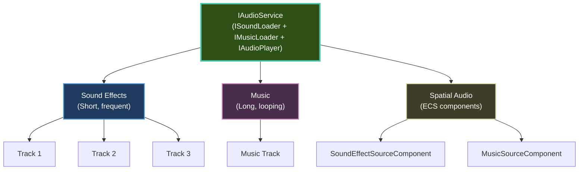

# Audio

Add sound effects, background music, and immersive spatial audio to your Brine2D games.

---

## Quick Start

```csharp
using Brine2D.Audio;

public class AudioScene : Scene
{
    private readonly ISoundLoader _soundLoader;
    private readonly IMusicLoader _musicLoader;
    private ISoundEffect? _jumpSound;
    private IMusic? _backgroundMusic;

    public AudioScene(ISoundLoader soundLoader, IMusicLoader musicLoader)
    {
        _soundLoader = soundLoader;
        _musicLoader = musicLoader;
    }

    protected override async Task OnLoadAsync(CancellationToken ct, IProgress<float>? progress = null)
    {
        _jumpSound = await _soundLoader.GetOrLoadSoundAsync("assets/jump.wav", ct);
        _backgroundMusic = await _musicLoader.GetOrLoadMusicAsync("assets/music.ogg", ct);

        Audio.PlayMusic(_backgroundMusic, loops: -1);
    }

    protected override void OnUpdate(GameTime gameTime)
    {
        if (Input.IsKeyPressed(Key.Space))
            Audio.PlaySound(_jumpSound!);
    }
}
```

---

## Topics

### Getting Started

| Guide | Description |
|-------|-------------|
| **[Getting Started](getting-started.md)** | Audio basics and setup | :star: Beginner |
| **[Sound Effects](sound-effects.md)** | Play sounds (jump, shoot, etc.) | :star: Beginner |
| **[Music Playback](music.md)** | Background music and looping | :star: Beginner |

### Advanced

| Guide | Description |
|-------|-------------|
| **[Spatial Audio](spatial-audio.md)** | 2D positional audio with distance/panning | :star::star::star: Advanced |

---

## Key Concepts

### Track-Based Audio

Brine2D uses a **track-based audio system** for precise control. `PlaySound` always returns a track handle:

```csharp
// Play sound and get track handle
nint track = Audio.PlaySound(_shootSound!, volume: 0.8f);

// Control specific track
Audio.SetTrackVolume(track, 0.6f);
Audio.SetTrackPan(track, 0.5f);
Audio.SetTrackPitch(track, 1.2f);
Audio.PauseTrack(track);
Audio.ResumeTrack(track);
Audio.StopTrack(track);

// Check if track is still playing
if (Audio.IsTrackAlive(track))
    Logger.LogInformation("Track still playing");
```

**Features:**

- Precise control over individual sounds
- Update volume, pan, and pitch in real-time
- Pause and resume individual tracks
- Priority-based eviction when tracks are full
- Bus-based grouping for batch operations

---

### Audio Architecture



**Narrow interfaces:** Depend on only what you need:

| Interface | Purpose |
|-----------|---------|
| `ISoundLoader` | Load sound effects (`GetOrLoadSoundAsync`) |
| `IMusicLoader` | Load music (`GetOrLoadMusicAsync`) |
| `IAudioPlayer` | Playback, volume, track control |
| `IAudioService` | All of the above (composite) |

The `Audio` property on `Scene` is `IAudioService`.

---

## Common Tasks

### Play Sound Effect

```csharp
private ISoundEffect? _explosionSound;

protected override async Task OnLoadAsync(CancellationToken ct, IProgress<float>? progress = null)
{
    _explosionSound = await _soundLoader.GetOrLoadSoundAsync("assets/explosion.wav", ct);
}

protected override void OnUpdate(GameTime gameTime)
{
    if (enemyKilled)
    {
        Audio.PlaySound(_explosionSound!);
        Audio.PlaySound(_explosionSound!, volume: 0.7f, pan: -0.3f, pitch: 1.1f);
    }
}
```

[:octicons-arrow-right-24: Full guide: Sound Effects](sound-effects.md)

---

### Play Background Music

```csharp
private IMusic? _music;

protected override async Task OnLoadAsync(CancellationToken ct, IProgress<float>? progress = null)
{
    _music = await _musicLoader.GetOrLoadMusicAsync("assets/background.ogg", ct);
    Audio.PlayMusic(_music, loops: -1);
}

protected override void OnUpdate(GameTime gameTime)
{
    if (Input.IsKeyPressed(Key.P))
    {
        if (Audio.IsMusicPaused)
            Audio.ResumeMusic();
        else
            Audio.PauseMusic();
    }
}
```

[:octicons-arrow-right-24: Full guide: Music Playback](music.md)

---

### Spatial Audio (ECS Components)

```csharp
// Create audio listener (player)
var player = World.CreateEntity("Player");
player.AddComponent<TransformComponent>(t => t.Position = new Vector2(400, 300));
player.AddComponent<AudioListenerComponent>();

// Create spatial audio source (enemy)
var enemy = World.CreateEntity("Enemy");
enemy.AddComponent<TransformComponent>(t => t.Position = new Vector2(200, 300));
enemy.AddComponent<SoundEffectSourceComponent>(src =>
{
    src.SoundEffect = _enemyGrowlSound;
    src.EnableSpatialAudio = true;
    src.MinDistance = 100f;
    src.MaxDistance = 500f;
    src.RolloffFactor = 1.0f;
    src.SpatialBlend = 1.0f;
    src.LoopCount = -1;
    src.PlayOnEnable = true;
});
```

[:octicons-arrow-right-24: Full guide: Spatial Audio](spatial-audio.md)

---

### Volume Control

```csharp
// Master volume (affects all audio)
Audio.MasterVolume = 0.8f;

// Sound effects volume
Audio.SoundVolume = 0.6f;

// Music volume
Audio.MusicVolume = 0.5f;

// Per-sound volume
Audio.PlaySound(_jumpSound!, volume: 0.9f);

// Update track volume/pan/pitch in real-time
nint track = Audio.PlaySound(_engineSound!, loops: -1);
Audio.SetTrackVolume(track, 0.7f);
Audio.SetTrackPan(track, 0.3f);
Audio.SetTrackPitch(track, 0.9f);
```

---

### Bus-Based Audio Grouping

```csharp
// Play sounds on named buses
nint track = Audio.PlaySound(_uiClick!, bus: "ui");

// Tag existing tracks
Audio.TagTrack(track, "ui");

// Pause/resume/stop entire buses
Audio.PauseBus("sfx");
Audio.ResumeBus("sfx");
Audio.StopBus("ui");

// Set per-bus volume
Audio.SetBusVolume("sfx", 0.5f);
```

---

## Supported Formats

| Format | Sound Effects | Music | Recommended For |
|--------|--------------|-----------------|
| **WAV** | :white_check_mark: Yes | :white_check_mark: Yes | Sound effects (uncompressed) |
| **OGG** | :white_check_mark: Yes | :white_check_mark: Yes | Music (compressed, high quality) |
| **MP3** | :white_check_mark: Yes | :white_check_mark: Yes | Music (compressed, smaller file) |
| **FLAC** | :white_check_mark: Yes | :white_check_mark: Yes | Music (lossless) |

**Recommendations:**

- **Sound effects:** WAV (fast loading, no decompression overhead)
- **Music:** OGG (good compression, no licensing issues)

---

## Best Practices

### :white_check_mark: DO

1. **Load sounds in OnLoadAsync** — Keep OnUpdate fast
2. **Use appropriate formats** — WAV for SFX, OGG for music
3. **Control volume** — Don't max out everything
4. **Use track handles for looping sounds** — Stop them when done
5. **Use buses for group control** — Pause all SFX during menus

```csharp
protected override async Task OnLoadAsync(CancellationToken ct, IProgress<float>? progress = null)
{
    _jumpSound = await _soundLoader.GetOrLoadSoundAsync("assets/jump.wav", ct);
    _music = await _musicLoader.GetOrLoadMusicAsync("assets/music.ogg", ct);
}

protected override void OnUpdate(GameTime gameTime)
{
    Audio.PlaySound(_jumpSound!);
}

protected override void OnExit()
{
    Audio.StopAllSounds();
    Audio.StopMusic();
}
```

---

### :x: DON'T

1. **Don't load sounds in OnUpdate** — Causes lag
2. **Don't play too many sounds** — Use `MaxConcurrentInstances` on `SoundEffectSourceComponent` or priority-based eviction
3. **Don't forget to stop music** — It plays between scenes
4. **Don't use MP3 for SFX** — Decoding overhead
5. **Don't max out volume** — Causes clipping/distortion

---

## Troubleshooting

### No Sound Playing

1. **Check volume levels:**
    ```csharp
    Logger.LogDebug("Master: {M}, Music: {Mu}, Sound: {S}",
        Audio.MasterVolume, Audio.MusicVolume, Audio.SoundVolume);
    ```

2. **Verify sound loaded** — `GetOrLoadSoundAsync` returns null on failure
3. **Check file exists** — Verify path and that assets are copied to output

### Music Continues Between Scenes

Stop music in `OnExit`:

```csharp
protected override void OnExit()
{
    Audio.StopMusic();
}
```

---

## Related Topics

- [Getting Started](getting-started.md) — Audio basics
- [Sound Effects](sound-effects.md) — Play sounds
- [Music Playback](music.md) — Background music
- [Spatial Audio](spatial-audio.md) — Positional audio

---

**Ready to add sound?** Start with [Getting Started](getting-started.md)!
