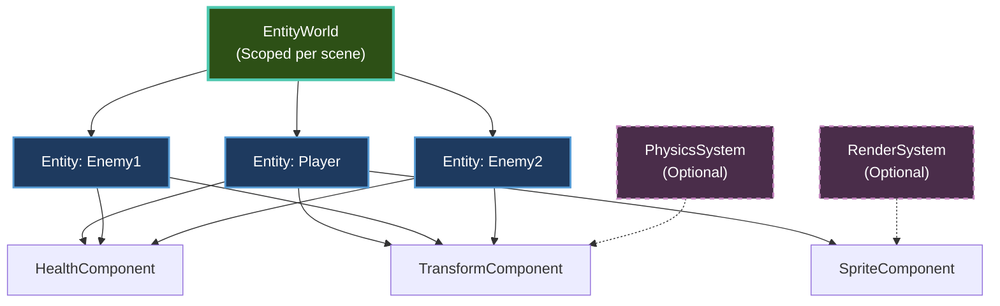

# Entity Component System

Learn how to use Brine2D's **hybrid ECS** (Entity-Component-System) to build flexible, maintainable game objects.

---

## Quick Start

```csharp
using Brine2D.ECS;

public class GameScene : Scene
{
    protected override Task OnLoadAsync(CancellationToken ct)
    {
        // Create entity
        var player = World.CreateEntity("Player");
        
        // Add components (with methods!)
        var health = player.AddComponent<HealthComponent>();
        health.Current = 100;
        health.Max = 100;
        
        var transform = player.AddComponent<TransformComponent>();
        transform.Position = new Vector2(400, 300);
        
        // Components can have methods
        health.TakeDamage(10);  // Current = 90
        
        Logger.LogInformation("Created player with {Health} HP", health.Current);
        
        return Task.CompletedTask;
    }
}
```

---

## Topics

### Getting Started

| Guide | Description |
|-------|-------------|
| **[Getting Started](getting-started.md)** | ECS basics and World access|
| **[Entities](entities.md)** | Create and manage entities|
| **[Components](components.md)** | Build components with data and methods|

### Intermediate

| Guide | Description |
|-------|-------------|
| **[Systems](systems.md)** | Optional systems for performance|
| **[Queries](queries.md)** | Find entities with specific components|

### Advanced

| Guide | Description |
|-------|-------------|
| **[Multi-Threading](multi-threading.md)** | Parallel entity processing|

---

## Key Concepts

### Hybrid ECS

Brine2D uses a **hybrid ECS** - beginner-friendly with optional performance optimizations:

| Feature | Brine2D | Strict ECS (Unity DOTS) |
|---------|---------|
| **Components with methods** | ? Allowed | ? Data only |
| **Entity logic** | ? Allowed | ? System only |
| **Easy to learn** | ? Yes | ?? Steep learning curve |
| **Performance optimization** | Optional systems | Required |

Start with simple per-entity logic; switch to systems only when profiling shows a need.

```csharp
// ? Brine2D - beginner-friendly
public class HealthComponent : Component
{
    public int Current { get; set; }
    public int Max { get; set; }
    
    // Methods allowed!
    public void TakeDamage(int amount)
    {
        Current = Math.Max(0, Current - amount);
    }
}

// ? Strict ECS - data only
public struct HealthComponent
{
    public int Current;
    public int Max;
    // No methods allowed!
}
```

[:octicons-arrow-right-24: Learn more: ECS Deep Dive](../fundamentals/entity-component-system.md)

---

### World Property

Every scene has a `World` property, automatically assigned by the framework:

```csharp
public class GameScene : Scene
{
    // ? World available automatically - no injection!
    
    protected override Task OnLoadAsync(CancellationToken ct)
    {
        // Access World directly
        var player = World.CreateEntity("Player");
        var enemy = World.CreateEntity("Enemy");
        
        Logger.LogInformation("Created {Count} entities", World.Entities.Count);
        
        return Task.CompletedTask;
    }
}
```

**Each scene gets its own isolated World** - automatic cleanup!

[:octicons-arrow-right-24: Learn more: Getting Started](getting-started.md#world-access-patterns)

---

### ECS Architecture



**Key insight:** Systems are **optional** - use for performance optimization when needed.

---

## Common Tasks

### Create Entity

```csharp
// Simple entity
var player = World.CreateEntity("Player");

// With components
var player = World.CreateEntity("Player");
player.AddComponent<HealthComponent>();
player.AddComponent<TransformComponent>();
player.AddComponent<SpriteComponent>();
```

[:octicons-arrow-right-24: Full guide: Entities](entities.md)

---

### Add Component

```csharp
// Add and configure
var health = player.AddComponent<HealthComponent>();
health.Current = 100;
health.Max = 100;

// Chaining
player.AddComponent<HealthComponent>()
      .AddComponent<TransformComponent>()
      .AddComponent<SpriteComponent>();
```

[:octicons-arrow-right-24: Full guide: Components](components.md)

---

### Query Entities

```csharp
// Find all entities with HealthComponent
var entities = World.Query<HealthComponent>().Execute();
foreach (var entity in entities)
{
    var health = entity.GetComponent<HealthComponent>();
    Logger.LogInformation("{Name} has {HP} HP", entity.Name, health.Current);
}

// Complex queries
var weakEnemies = World.Query()
    .With<HealthComponent>()
    .WithTag("Enemy")
    .Where(e => e.GetComponent<HealthComponent>().Current < 50)
    .Execute();
```

[:octicons-arrow-right-24: Full guide: Queries](queries.md)

---

### Create System (Optional)

```csharp
public class MovementSystem : GameSystem
{
    protected override void OnUpdate(GameTime gameTime)
    {
        var deltaTime = (float)gameTime.DeltaTime;
        
        // Process all entities with required components
        foreach (var entity in World.GetEntitiesWithComponents<TransformComponent, VelocityComponent>())
        {
            var transform = entity.GetComponent<TransformComponent>();
            var velocity = entity.GetComponent<VelocityComponent>();
            
            transform.Position += velocity.Value * deltaTime;
        }
    }
}

// Register system
builder.Services.AddSingleton<MovementSystem>();
```

[:octicons-arrow-right-24: Full guide: Systems](systems.md)

---

## Component Examples

### Health Component

```csharp
public class HealthComponent : Component
{
    public int Current { get; set; }
    public int Max { get; set; }
    
    public bool IsDead => Current <= 0;
    public float HealthPercent => (float)Current / Max;
    
    public void TakeDamage(int amount)
    {
        Current = Math.Max(0, Current - amount);
        
        if (IsDead && Entity != null)
        {
            Logger.LogInformation("{Name} died", Entity.Name);
            Entity.World?.DestroyEntity(Entity);
        }
    }
    
    public void Heal(int amount)
    {
        Current = Math.Min(Max, Current + amount);
    }
}
```

---

### Transform Component

```csharp
public class TransformComponent : Component
{
    public Vector2 Position { get; set; }
    public float Rotation { get; set; }
    public Vector2 Scale { get; set; } = Vector2.One;
    
    public void Move(Vector2 delta)
    {
        Position += delta;
    }
    
    public void Rotate(float degrees)
    {
        Rotation += degrees;
    }
}
```

---

### Velocity Component

```csharp
public class VelocityComponent : Component
{
    public Vector2 Value { get; set; }
    
    protected internal override void OnUpdate(GameTime gameTime)
    {
        // Components can update themselves!
        var transform = GetRequiredComponent<TransformComponent>();
        transform.Position += Value * (float)gameTime.DeltaTime;
    }
}
```

[:octicons-arrow-right-24: More examples: Components Guide](components.md)

---

## Best Practices

### ? DO

1. **Use composition over inheritance** - Combine components for behavior
2. **Keep components focused** - One responsibility per component
3. **Use World property** - Access via framework property
4. **Let automatic cleanup happen** - World disposed on scene unload
5. **Add systems when needed** - Optimize bottlenecks only

```csharp
// ? Good - composition
var player = World.CreateEntity("Player");
player.AddComponent<HealthComponent>();
player.AddComponent<TransformComponent>();
player.AddComponent<PlayerInputComponent>();

// Components define behavior through composition
```

---

### ? DON'T

1. **Don't inject IEntityWorld** - Use framework property
2. **Don't manually clear World** - Automatic on scene unload
3. **Don't create deep inheritance** - Use composition
4. **Don't optimize prematurely** - Systems are optional
5. **Don't store entities in static fields** - Prevents garbage collection

```csharp
// ? Bad - don't inject World
public GameScene(IEntityWorld world)
{
    // Framework property is better!
}

// ? Bad - deep inheritance
public class Enemy : Character : GameObject
{
    // Use composition instead!
}
```

---

## Performance Tips

### Use Cached Queries

```csharp
private CachedQuery<TransformComponent, VelocityComponent> _movingEntities;

protected override Task OnLoadAsync(CancellationToken ct)
{
    // Create once
    _movingEntities = World.CreateCachedQuery<TransformComponent, VelocityComponent>();
    return Task.CompletedTask;
}

protected override void OnUpdate(GameTime gameTime)
{
    // Reuse - no allocation!
    foreach (var (transform, velocity) in _movingEntities)
    {
        transform.Position += velocity.Value * (float)gameTime.DeltaTime;
    }
}
```

[:octicons-arrow-right-24: Learn more: Queries](queries.md#cached-queries)

---

### Use Systems for Hot Paths

```csharp
// System - better for performance
public class MovementSystem : GameSystem
{
    protected override void OnUpdate(GameTime gameTime)
    {
        // Batch processing - faster
        foreach (var entity in World.GetEntitiesWithComponents<TransformComponent, VelocityComponent>())
        {
            // Process all at once
        }
    }
}
```

[:octicons-arrow-right-24: Learn more: Systems](systems.md)

---

## Troubleshooting

### "World is null" Error

**Symptom:** NullReferenceException when accessing World

**Cause:** Trying to use World in constructor

**Solution:** Use lifecycle methods

```csharp
// ? Wrong
public GameScene()
{
    World.CreateEntity("Player");  // NULL!
}

// ? Correct
protected override Task OnLoadAsync(CancellationToken ct)
{
    World.CreateEntity("Player");  // Works!
    return Task.CompletedTask;
}
```

---

### Component Not Found

**Symptom:** `GetComponent<T>()` returns null

**Solutions:**

1. **Use `GetRequiredComponent<T>()`** - Throws if missing

```csharp
// ? May return null
var health = entity.GetComponent<HealthComponent>();
health.Current = 100;  // NullReferenceException if not found!

// ? Throws if missing
var health = entity.GetRequiredComponent<HealthComponent>();
health.Current = 100;  // Safe - component guaranteed to exist
```

2. **Check component exists:**

```csharp
if (entity.HasComponent<HealthComponent>())
{
    var health = entity.GetComponent<HealthComponent>();
    // Safe to use
}
```

---

### Memory Leak

**Symptom:** Entities not destroyed after scene change

**Cause:** Storing entities in static fields or singleton services

**Solution:** Don't store entity references outside scene scope

```csharp
// ? Bad - prevents garbage collection
public static Entity GlobalPlayer;

public class GameState  // Singleton service
{
    public Entity Player { get; set; }  // ? Bad
}

// ? Good - store in scene
public class GameScene : Scene
{
    private Entity? _player;  // ? Destroyed with scene
}
```

---

## Related Topics

- [Getting Started](getting-started.md) - ECS basics
- [Entities](entities.md) - Entity management
- [Components](components.md) - Component guide
- [Systems](systems.md) - Optional systems
- [Queries](queries.md) - Find entities
- [Multi-Threading](multi-threading.md) - Parallel processing
- [Fundamentals: ECS Deep Dive](../fundamentals/entity-component-system.md) - Architecture details

---

**Ready to build with ECS?** Start with [Getting Started](getting-started.md)!