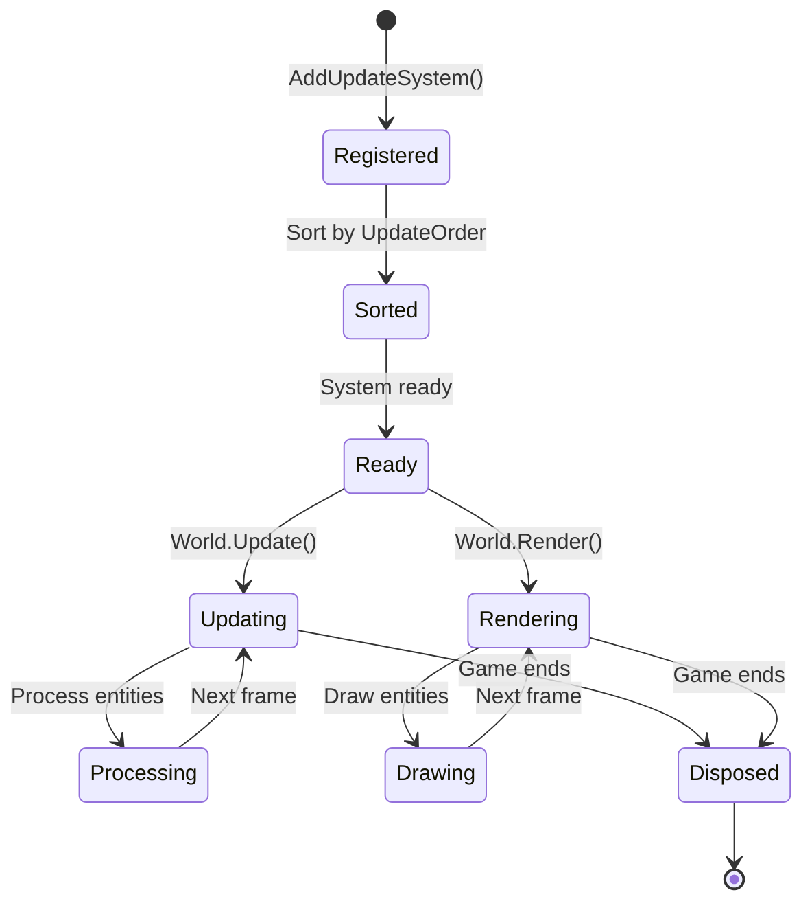

# ECS Systems

Master ECS systems - the logic layer of your game that processes entities with specific components.

## Overview

Systems contain game logic and operate on entities with specific components:

- **Update Systems** - Process game logic each frame
- **Render Systems** - Draw entities to screen
- **Specialized Systems** - Physics, AI, collision, etc.

**Core principle:** Systems have logic, components have data.

**Benefits:**
- Clear separation of concerns
- Easy to add/remove features
- Testable in isolation
- Reusable across projects

---

## System Types

### Update Systems

Process game logic each frame:

```csharp
public interface IUpdateSystem
{
    string Name { get; }
    int UpdateOrder { get; }
    void Update(GameTime gameTime);
}
```

**Usage:**
- Physics simulation
- AI behavior
- Player input
- Collision detection
- Animation
- Health/damage

---

### Render Systems

Draw entities to screen:

```csharp
public interface IRenderSystem
{
    string Name { get; }
    int RenderOrder { get; }
    void Render(GameTime gameTime);
}
```

**Usage:**
- Sprite rendering
- Particle effects
- Debug visualization
- UI rendering
- Post-processing

---

## System Lifecycle



**Lifecycle stages:**

| Stage | Description | When |
|-------|-------------|------|
| **Registered** | Added to world | `AddUpdateSystem()` |
| **Sorted** | Ordered by priority | After registration |
| **Updating** | Processing entities | Every `World.Update()` |
| **Rendering** | Drawing entities | Every `World.Render()` |

---

## Creating Systems

### Basic Update System

```csharp
using Brine2D.Core;
using Brine2D.ECS;

public class MovementSystem : IUpdateSystem
{
    private readonly World _world;
    
    public string Name => "MovementSystem";
    public int UpdateOrder => 100;
    
    public MovementSystem(World world)
    {
        _world = world;
    }
    
    public void Update(GameTime gameTime)
    {
        var deltaTime = (float)gameTime.DeltaTime;
        
        // Query entities
        var entities = _world.QueryEntities()
            .With<TransformComponent>()
            .With<VelocityComponent>();
        
        // Process each entity
        foreach (var entity in entities)
        {
            var transform = entity.GetComponent<TransformComponent>();
            var velocity = entity.GetComponent<VelocityComponent>();
            
            if (transform != null && velocity != null)
            {
                transform.Position += velocity.Velocity * deltaTime;
            }
        }
    }
}
```

**Pattern:**
1. Query entities with required components
2. Get components from each entity
3. Process game logic
4. Use deltaTime for frame-rate independence

---

### Basic Render System

```csharp
using Brine2D.Core;
using Brine2D.ECS;
using Brine2D.Rendering;

public class SpriteRenderSystem : IRenderSystem
{
    private readonly World _world;
    private readonly IRenderer _renderer;
    
    public string Name => "SpriteRenderSystem";
    public int RenderOrder => 100;
    
    public SpriteRenderSystem(World world, IRenderer renderer)
    {
        _world = world;
        _renderer = renderer;
    }
    
    public void Render(GameTime gameTime)
    {
        // Query entities
        var entities = _world.QueryEntities()
            .With<TransformComponent>()
            .With<SpriteComponent>();
        
        // Draw each entity
        foreach (var entity in entities)
        {
            var transform = entity.GetComponent<TransformComponent>();
            var sprite = entity.GetComponent<SpriteComponent>();
            
            if (transform != null && sprite != null && sprite.Texture != null)
            {
                _renderer.DrawTexture(
                    sprite.Texture,
                    transform.Position.X,
                    transform.Position.Y,
                    sprite.Width,
                    sprite.Height);
            }
        }
    }
}
```

---

## System Ordering

### Update Order

Systems run in order of `UpdateOrder` (lower runs first):


**Recommended ordering:**

| Order | System | Purpose |
|-------|--------|---------|
| 0-20 | Input | Process player input |
| 20-50 | AI | Calculate AI decisions |
| 50-100 | Physics | Apply forces, gravity |
| 100-150 | Movement | Update positions |
| 150-200 | Collision | Detect collisions |
| 200+ | Cleanup | Remove dead entities |

**Example:**

```csharp
public class InputSystem : IUpdateSystem
{
    public int UpdateOrder => 10; // First
}

public class AISystem : IUpdateSystem
{
    public int UpdateOrder => 20; // After input
}

public class PhysicsSystem : IUpdateSystem
{
    public int UpdateOrder => 50; // After AI
}

public class MovementSystem : IUpdateSystem
{
    public int UpdateOrder => 100; // After physics
}

public class CollisionSystem : IUpdateSystem
{
    public int UpdateOrder => 150; // After movement
}
```

---

### Render Order

Render systems also use ordering for layer control:

```csharp
public class BackgroundRenderSystem : IRenderSystem
{
    public int RenderOrder => 10; // Draw first (back)
}

public class SpriteRenderSystem : IRenderSystem
{
    public int RenderOrder => 100; // Draw middle
}

public class UIRenderSystem : IRenderSystem
{
    public int RenderOrder => 200; // Draw last (front)
}

public class DebugRenderSystem : IRenderSystem
{
    public int RenderOrder => 1000; // Draw on top of everything
}
```

---

## Common System Patterns

### Physics System

Applies forces and gravity:

```csharp
public class PhysicsSystem : IUpdateSystem
{
    private readonly World _world;
    private const float Gravity = 980f; // pixels/sec²
    
    public string Name => "PhysicsSystem";
    public int UpdateOrder => 50;
    
    public PhysicsSystem(World world)
    {
        _world = world;
    }
    
    public void Update(GameTime gameTime)
    {
        var deltaTime = (float)gameTime.DeltaTime;
        
        var entities = _world.QueryEntities()
            .With<RigidbodyComponent>();
        
        foreach (var entity in entities)
        {
            var rigidbody = entity.GetComponent<RigidbodyComponent>();
            
            if (rigidbody != null)
            {
                // Apply gravity
                if (rigidbody.UseGravity)
                {
                    rigidbody.Velocity.Y += Gravity * deltaTime;
                }
                
                // Apply drag
                rigidbody.Velocity *= (1.0f - rigidbody.Drag * deltaTime);
                
                // Clamp velocity
                var maxSpeed = 1000f;
                if (rigidbody.Velocity.Length() > maxSpeed)
                {
                    rigidbody.Velocity = Vector2.Normalize(rigidbody.Velocity) * maxSpeed;
                }
            }
        }
    }
}
```

---

### AI System

Simple chase AI:

```csharp
public class ChaseAISystem : IUpdateSystem
{
    private readonly World _world;
    
    public string Name => "ChaseAISystem";
    public int UpdateOrder => 20;
    
    public ChaseAISystem(World world)
    {
        _world = world;
    }
    
    public void Update(GameTime gameTime)
    {
        // Find player
        var players = _world.QueryEntities().With<PlayerComponent>();
        var playerPosition = Vector2.Zero;
        var hasPlayer = false;
        
        foreach (var player in players)
        {
            var transform = player.GetComponent<TransformComponent>();
            if (transform != null)
            {
                playerPosition = transform.Position;
                hasPlayer = true;
                break;
            }
        }
        
        if (!hasPlayer) return;
        
        // Update enemies
        var enemies = _world.QueryEntities()
            .With<EnemyComponent>()
            .With<TransformComponent>()
            .With<VelocityComponent>();
        
        foreach (var enemy in enemies)
        {
            var transform = enemy.GetComponent<TransformComponent>();
            var velocity = enemy.GetComponent<VelocityComponent>();
            
            if (transform != null && velocity != null)
            {
                var direction = playerPosition - transform.Position;
                var distance = direction.Length();
                
                // Chase if far away
                if (distance > 100f)
                {
                    direction = Vector2.Normalize(direction);
                    velocity.Velocity = direction * velocity.Speed;
                }
                // Stop if close
                else if (distance < 50f)
                {
                    velocity.Velocity = Vector2.Zero;
                }
            }
        }
    }
}
```

---

### Collision System

AABB collision detection:

```csharp
public class CollisionSystem : IUpdateSystem
{
    private readonly World _world;
    private readonly EventBus _eventBus;
    
    public string Name => "CollisionSystem";
    public int UpdateOrder => 150;
    
    public CollisionSystem(World world, EventBus eventBus)
    {
        _world = world;
        _eventBus = eventBus;
    }
    
    public void Update(GameTime gameTime)
    {
        var entities = _world.QueryEntities()
            .With<TransformComponent>()
            .With<ColliderComponent>()
            .ToList();
        
        // Check all pairs
        for (int i = 0; i < entities.Count; i++)
        {
            for (int j = i + 1; j < entities.Count; j++)
            {
                CheckCollision(entities[i], entities[j]);
            }
        }
    }
    
    private void CheckCollision(Entity a, Entity b)
    {
        var transformA = a.GetComponent<TransformComponent>();
        var colliderA = a.GetComponent<ColliderComponent>();
        var transformB = b.GetComponent<TransformComponent>();
        var colliderB = b.GetComponent<ColliderComponent>();
        
        if (transformA == null || colliderA == null ||
            transformB == null || colliderB == null)
        {
            return;
        }
        
        // AABB collision
        var rectA = new Rectangle(
            transformA.Position.X + colliderA.Offset.X,
            transformA.Position.Y + colliderA.Offset.Y,
            colliderA.Size.X,
            colliderA.Size.Y);
        
        var rectB = new Rectangle(
            transformB.Position.X + colliderB.Offset.X,
            transformB.Position.Y + colliderB.Offset.Y,
            colliderB.Size.X,
            colliderB.Size.Y);
        
        if (rectA.Intersects(rectB))
        {
            // Publish collision event
            _eventBus.Publish(new CollisionEvent
            {
                EntityA = a,
                EntityB = b
            });
        }
    }
}
```

---

### Animation System

Sprite sheet animation:

```csharp
public class AnimationSystem : IUpdateSystem
{
    private readonly World _world;
    
    public string Name => "AnimationSystem";
    public int UpdateOrder => 90;
    
    public AnimationSystem(World world)
    {
        _world = world;
    }
    
    public void Update(GameTime gameTime)
    {
        var deltaTime = (float)gameTime.DeltaTime;
        
        var entities = _world.QueryEntities()
            .With<SpriteComponent>()
            .With<AnimationComponent>();
        
        foreach (var entity in entities)
        {
            var sprite = entity.GetComponent<SpriteComponent>();
            var animation = entity.GetComponent<AnimationComponent>();
            
            if (sprite == null || animation == null) continue;
            
            // Update animation timer
            animation.CurrentTime += deltaTime;
            
            // Check if frame should advance
            if (animation.CurrentTime >= animation.FrameDuration)
            {
                animation.CurrentTime -= animation.FrameDuration;
                animation.CurrentFrame++;
                
                // Loop animation
                if (animation.CurrentFrame >= animation.FrameCount)
                {
                    animation.CurrentFrame = animation.Loop ? 0 : animation.FrameCount - 1;
                }
                
                // Update sprite source rect
                sprite.SourceRect = new Rectangle(
                    animation.CurrentFrame * animation.FrameWidth,
                    0,
                    animation.FrameWidth,
                    animation.FrameHeight);
            }
        }
    }
}
```

---

### Health System

Manages entity health and death:

```csharp
public class HealthSystem : IUpdateSystem
{
    private readonly World _world;
    private readonly EventBus _eventBus;
    
    public string Name => "HealthSystem";
    public int UpdateOrder => 180;
    
    public HealthSystem(World world, EventBus eventBus)
    {
        _world = world;
        _eventBus = eventBus;
    }
    
    public void Update(GameTime gameTime)
    {
        var entities = _world.QueryEntities()
            .With<HealthComponent>();
        
        var deadEntities = new List<Entity>();
        
        foreach (var entity in entities)
        {
            var health = entity.GetComponent<HealthComponent>();
            
            if (health == null) continue;
            
            // Clamp health
            health.Current = Math.Clamp(health.Current, 0, health.Max);
            
            // Process regeneration
            if (health.RegenerationRate > 0)
            {
                health.Current = Math.Min(
                    health.Current + (int)(health.RegenerationRate * (float)gameTime.DeltaTime),
                    health.Max);
            }
            
            // Check death
            if (health.IsDead)
            {
                deadEntities.Add(entity);
            }
        }
        
        // Handle deaths
        foreach (var entity in deadEntities)
        {
            _eventBus.Publish(new EntityDiedEvent { Entity = entity });
            _world.DestroyEntity(entity);
        }
    }
}
```

---

### Particle System

Updates particle lifetime:

```csharp
public class ParticleSystem : IUpdateSystem
{
    private readonly World _world;
    
    public string Name => "ParticleSystem";
    public int UpdateOrder => 170;
    
    public ParticleSystem(World world)
    {
        _world = world;
    }
    
    public void Update(GameTime gameTime)
    {
        var deltaTime = (float)gameTime.DeltaTime;
        
        var particles = _world.QueryEntities()
            .With<ParticleComponent>();
        
        foreach (var particle in particles)
        {
            var particleComp = particle.GetComponent<ParticleComponent>();
            
            if (particleComp == null) continue;
            
            // Update lifetime
            particleComp.Lifetime -= deltaTime;
            
            // Remove dead particles
            if (particleComp.Lifetime <= 0)
            {
                _world.DestroyEntity(particle);
                continue;
            }
            
            // Fade out based on lifetime
            var sprite = particle.GetComponent<SpriteComponent>();
            if (sprite != null)
            {
                var alpha = (byte)(255 * (particleComp.Lifetime / particleComp.MaxLifetime));
                sprite.Color = new Color(
                    sprite.Color.R,
                    sprite.Color.G,
                    sprite.Color.B,
                    alpha);
            }
            
            // Scale down over time
            var transform = particle.GetComponent<TransformComponent>();
            if (transform != null)
            {
                var scale = particleComp.Lifetime / particleComp.MaxLifetime;
                transform.Scale = new Vector2(scale, scale);
            }
        }
    }
}
```

---

## System Communication

### Event-Based Communication

Systems communicate via events:

```csharp
// Event definition
public class CollisionEvent
{
    public Entity EntityA { get; set; }
    public Entity EntityB { get; set; }
}

public class EntityDiedEvent
{
    public Entity Entity { get; set; }
}

// Event bus
public class EventBus
{
    private readonly Dictionary<Type, List<Delegate>> _handlers = new();
    
    public void Subscribe<T>(Action<T> handler)
    {
        var type = typeof(T);
        if (!_handlers.ContainsKey(type))
        {
            _handlers[type] = new List<Delegate>();
        }
        _handlers[type].Add(handler);
    }
    
    public void Publish<T>(T evt)
    {
        var type = typeof(T);
        if (_handlers.TryGetValue(type, out var handlers))
        {
            foreach (var handler in handlers)
            {
                ((Action<T>)handler)(evt);
            }
        }
    }
}

// System subscribing to events
public class ScoreSystem : IUpdateSystem
{
    private readonly EventBus _eventBus;
    private int _score;
    
    public string Name => "ScoreSystem";
    public int UpdateOrder => 190;
    
    public ScoreSystem(EventBus eventBus)
    {
        _eventBus = eventBus;
        
        // Subscribe to entity death
        _eventBus.Subscribe<EntityDiedEvent>(OnEntityDied);
    }
    
    private void OnEntityDied(EntityDiedEvent evt)
    {
        // Award points for enemy deaths
        if (evt.Entity.HasComponent<EnemyComponent>())
        {
            _score += 10;
        }
    }
    
    public void Update(GameTime gameTime)
    {
        // Score system logic
    }
}
```

---

### Shared Components

Systems can share data via components:

```csharp
// Global game state component
public class GameStateComponent : Component
{
    public int Score { get; set; }
    public int Wave { get; set; }
    public float TimeRemaining { get; set; }
}

// System A modifies score
public class ScoreSystem : IUpdateSystem
{
    public void Update(GameTime gameTime)
    {
        var gameState = _world.GetSingleton<GameStateComponent>();
        if (gameState != null)
        {
            gameState.Score += 10;
        }
    }
}

// System B reads score
public class UISystem : IRenderSystem
{
    public void Render(GameTime gameTime)
    {
        var gameState = _world.GetSingleton<GameStateComponent>();
        if (gameState != null)
        {
            _renderer.DrawText($"Score: {gameState.Score}", 10, 10, Color.White);
        }
    }
}
```

---

## Advanced Patterns

### System Groups

Group related systems:

```csharp
public interface ISystemGroup
{
    void Initialize(World world);
    void Update(GameTime gameTime);
}

public class PhysicsSystemGroup : ISystemGroup
{
    private readonly List<IUpdateSystem> _systems = new();
    
    public void Initialize(World world)
    {
        _systems.Add(new GravitySystem(world));
        _systems.Add(new VelocitySystem(world));
        _systems.Add(new CollisionSystem(world));
        
        foreach (var system in _systems)
        {
            world.AddUpdateSystem(system);
        }
    }
    
    public void Update(GameTime gameTime)
    {
        foreach (var system in _systems)
        {
            system.Update(gameTime);
        }
    }
}
```

---

### Conditional Systems

Systems that can be enabled/disabled:

```csharp
public class ConditionalSystem : IUpdateSystem
{
    private readonly World _world;
    private bool _enabled = true;
    
    public string Name => "ConditionalSystem";
    public int UpdateOrder => 100;
    public bool Enabled { get => _enabled; set => _enabled = value; }
    
    public ConditionalSystem(World world)
    {
        _world = world;
    }
    
    public void Update(GameTime gameTime)
    {
        if (!_enabled) return; // Skip if disabled
        
        // System logic
    }
}

// Usage
var system = new ConditionalSystem(world);
world.AddUpdateSystem(system);

// Disable system
system.Enabled = false; // System stops processing

// Enable system
system.Enabled = true; // System resumes
```

---

### Parallel Systems

Systems that can run in parallel:

```csharp
public class ParallelMovementSystem : IUpdateSystem
{
    private readonly World _world;
    
    public string Name => "ParallelMovementSystem";
    public int UpdateOrder => 100;
    
    public ParallelMovementSystem(World world)
    {
        _world = world;
    }
    
    public void Update(GameTime gameTime)
    {
        var deltaTime = (float)gameTime.DeltaTime;
        
        var entities = _world.QueryEntities()
            .With<TransformComponent>()
            .With<VelocityComponent>()
            .ToList();
        
        // Process entities in parallel
        Parallel.ForEach(entities, entity =>
        {
            var transform = entity.GetComponent<TransformComponent>();
            var velocity = entity.GetComponent<VelocityComponent>();
            
            if (transform != null && velocity != null)
            {
                // Note: Ensure thread-safety!
                lock (transform)
                {
                    transform.Position += velocity.Velocity * deltaTime;
                }
            }
        });
    }
}
```

**Warning:** Use parallel processing carefully - ensure thread-safety!

---

## Performance Optimization

### Cache Queries

```csharp
// ❌ Bad - queries every frame
public void Update(GameTime gameTime)
{
    for (int i = 0; i < 100; i++)
    {
        var entities = _world.QueryEntities().With<TransformComponent>();
        // Process...
    }
}

// ✅ Good - query once
public void Update(GameTime gameTime)
{
    var entities = _world.QueryEntities()
        .With<TransformComponent>()
        .ToList(); // Cache result
    
    for (int i = 0; i < 100; i++)
    {
        // Process cached list
    }
}
```

---

### Early Exit

```csharp
public void Update(GameTime gameTime)
{
    var entities = _world.QueryEntities()
        .With<TransformComponent>();
    
    // Early exit if no entities
    if (!entities.Any()) return;
    
    foreach (var entity in entities)
    {
        // Process...
    }
}
```

---

### Spatial Partitioning

For collision systems:

```csharp
public class SpatialGrid
{
    private readonly Dictionary<(int, int), List<Entity>> _cells = new();
    private readonly float _cellSize;
    
    public SpatialGrid(float cellSize = 100f)
    {
        _cellSize = cellSize;
    }
    
    public void Clear()
    {
        _cells.Clear();
    }
    
    public void Add(Entity entity, Vector2 position)
    {
        var cell = GetCell(position);
        if (!_cells.ContainsKey(cell))
        {
            _cells[cell] = new List<Entity>();
        }
        _cells[cell].Add(entity);
    }
    
    public IEnumerable<Entity> GetNearby(Vector2 position)
    {
        var cell = GetCell(position);
        
        // Check surrounding cells
        for (int x = -1; x <= 1; x++)
        {
            for (int y = -1; y <= 1; y++)
            {
                var checkCell = (cell.Item1 + x, cell.Item2 + y);
                if (_cells.TryGetValue(checkCell, out var entities))
                {
                    foreach (var entity in entities)
                    {
                        yield return entity;
                    }
                }
            }
        }
    }
    
    private (int, int) GetCell(Vector2 position)
    {
        return (
            (int)(position.X / _cellSize),
            (int)(position.Y / _cellSize)
        );
    }
}

// Usage in collision system
public class OptimizedCollisionSystem : IUpdateSystem
{
    private readonly World _world;
    private readonly SpatialGrid _grid = new(100f);
    
    public void Update(GameTime gameTime)
    {
        _grid.Clear();
        
        // Add all entities to grid
        var entities = _world.QueryEntities()
            .With<TransformComponent>()
            .With<ColliderComponent>()
            .ToList();
        
        foreach (var entity in entities)
        {
            var transform = entity.GetComponent<TransformComponent>();
            if (transform != null)
            {
                _grid.Add(entity, transform.Position);
            }
        }
        
        // Check collisions only against nearby entities
        foreach (var entity in entities)
        {
            var transform = entity.GetComponent<TransformComponent>();
            if (transform == null) continue;
            
            foreach (var other in _grid.GetNearby(transform.Position))
            {
                if (entity != other)
                {
                    CheckCollision(entity, other);
                }
            }
        }
    }
}
```

---

## Debugging Systems

### System Profiling

```csharp
public class ProfiledSystem : IUpdateSystem
{
    private readonly IUpdateSystem _innerSystem;
    private readonly ILogger _logger;
    private readonly Stopwatch _stopwatch = new();
    
    public string Name => _innerSystem.Name;
    public int UpdateOrder => _innerSystem.UpdateOrder;
    
    public ProfiledSystem(IUpdateSystem innerSystem, ILogger logger)
    {
        _innerSystem = innerSystem;
        _logger = logger;
    }
    
    public void Update(GameTime gameTime)
    {
        _stopwatch.Restart();
        
        _innerSystem.Update(gameTime);
        
        _stopwatch.Stop();
        
        if (_stopwatch.ElapsedMilliseconds > 16) // > 1 frame at 60 FPS
        {
            _logger.LogWarning(
                "System {Name} took {Ms}ms (slow!)",
                Name, _stopwatch.ElapsedMilliseconds);
        }
    }
}
```

---

### Debug Visualization System

```csharp
public class DebugRenderSystem : IRenderSystem
{
    private readonly World _world;
    private readonly IRenderer _renderer;
    private bool _enabled = true;
    
    public string Name => "DebugRenderSystem";
    public int RenderOrder => 1000; // Draw on top
    public bool Enabled { get => _enabled; set => _enabled = value; }
    
    public DebugRenderSystem(World world, IRenderer renderer)
    {
        _world = world;
        _renderer = renderer;
    }
    
    public void Render(GameTime gameTime)
    {
        if (!_enabled) return;
        
        // Draw collider bounds
        var entities = _world.QueryEntities()
            .With<TransformComponent>()
            .With<ColliderComponent>();
        
        foreach (var entity in entities)
        {
            var transform = entity.GetComponent<TransformComponent>();
            var collider = entity.GetComponent<ColliderComponent>();
            
            if (transform != null && collider != null)
            {
                _renderer.DrawRectangle(
                    transform.Position.X + collider.Offset.X,
                    transform.Position.Y + collider.Offset.Y,
                    collider.Size.X,
                    collider.Size.Y,
                    Color.Green);
            }
        }
        
        // Draw entity count
        var count = _world.GetAllEntities().Count();
        _renderer.DrawText($"Entities: {count}", 10, 50, Color.Yellow);
    }
}
```

---

## Best Practices

### DO

1. **Keep systems focused**
   ```csharp
   // ✅ Good - single responsibility
   public class MovementSystem : IUpdateSystem
   {
       // Only handles movement
   }
   
   public class CollisionSystem : IUpdateSystem
   {
       // Only handles collision
   }
   ```

2. **Use explicit ordering**
   ```csharp
   // ✅ Good - clear order
   public class InputSystem : IUpdateSystem
   {
       public int UpdateOrder => 10;
   }
   
   public class MovementSystem : IUpdateSystem
   {
       public int UpdateOrder => 100;
   }
   ```

3. **Cache query results**
   ```csharp
   // ✅ Good - query once
   var entities = _world.QueryEntities()
       .With<TransformComponent>()
       .ToList();
   
   foreach (var entity in entities)
   {
       // Process
   }
   ```

4. **Use events for system communication**
   ```csharp
   // ✅ Good - loose coupling
   _eventBus.Publish(new EntityDiedEvent { Entity = entity });
   ```

5. **Make systems stateless when possible**
   ```csharp
   // ✅ Good - no state
   public class MovementSystem : IUpdateSystem
   {
       private readonly World _world; // Dependency, not state
       
       public void Update(GameTime gameTime)
       {
           // Process entities
       }
   }
   ```

### DON'T

1. **Don't store entity-specific state in systems**
   ```csharp
   // ❌ Bad - state in system
   public class MovementSystem : IUpdateSystem
   {
       private Vector2 _playerPosition; // Wrong!
   }
   
   // ✅ Good - state in component
   public class TransformComponent : Component
   {
       public Vector2 Position { get; set; }
   }
   ```

2. **Don't query inside loops**
   ```csharp
   // ❌ Bad - queries every iteration
   for (int i = 0; i < 100; i++)
   {
       var entities = _world.QueryEntities().With<EnemyComponent>();
   }
   
   // ✅ Good - query once
   var entities = _world.QueryEntities()
       .With<EnemyComponent>()
       .ToList();
   
   for (int i = 0; i < 100; i++)
   {
       // Use cached list
   }
   ```

3. **Don't create tight dependencies**
   ```csharp
   // ❌ Bad - tight coupling
   public class SystemA : IUpdateSystem
   {
       private readonly SystemB _systemB; // Coupled to another system!
   }
   
   // ✅ Good - use events
   public class SystemA : IUpdateSystem
   {
       private readonly EventBus _eventBus; // Loose coupling
   }
   ```

4. **Don't forget deltaTime**
   ```csharp
   // ❌ Bad - frame-rate dependent
   transform.Position += velocity.Velocity;
   
   // ✅ Good - frame-rate independent
   transform.Position += velocity.Velocity * deltaTime;
   ```

---

## Troubleshooting

### Problem: System not running

**Symptom:** System's Update method never called.

**Solutions:**

1. **Check system is registered:**
   ```csharp
   _world.AddUpdateSystem(new MovementSystem(_world));
   ```

2. **Verify World.Update is called:**
   ```csharp
   protected override void OnUpdate(GameTime gameTime)
   {
       _world.Update(gameTime); // Must call!
   }
   ```

3. **Check system order isn't causing early exit:**
   ```csharp
   // Make sure system order makes sense
   public int UpdateOrder => 100; // Not too high/low
   ```

---

### Problem: Systems run in wrong order

**Symptom:** Collisions detect before movement, etc.

**Solution:** Set UpdateOrder correctly:

```csharp
// ✅ Correct ordering
public class InputSystem : IUpdateSystem { public int UpdateOrder => 10; }
public class MovementSystem : IUpdateSystem { public int UpdateOrder => 100; }
public class CollisionSystem : IUpdateSystem { public int UpdateOrder => 150; }
```

---

### Problem: Performance issues

**Symptom:** Game runs slowly with many entities.

**Solutions:**

1. **Profile systems:**
   ```csharp
   var sw = Stopwatch.StartNew();
   system.Update(gameTime);
   sw.Stop();
   
   Logger.LogDebug("{System} took {Ms}ms", system.Name, sw.ElapsedMilliseconds);
   ```

2. **Cache queries:**
   ```csharp
   var entities = _world.QueryEntities()
       .With<TransformComponent>()
       .ToList(); // Cache
   ```

3. **Use spatial partitioning:**
   - Only check nearby entities
   - Reduces O(n²) to ~O(n)

---

### Problem: Systems interfering with each other

**Symptom:** System A's changes undone by System B.

**Solution:** Check system ordering:

```csharp
// ✅ Correct - CollisionSystem runs after MovementSystem
public class MovementSystem : IUpdateSystem { public int UpdateOrder => 100; }
public class CollisionSystem : IUpdateSystem { public int UpdateOrder => 150; }

// ❌ Wrong - CollisionSystem runs before MovementSystem
public class CollisionSystem : IUpdateSystem { public int UpdateOrder => 50; }
public class MovementSystem : IUpdateSystem { public int UpdateOrder => 100; }
```

---

## Summary

**System types:**

| Type | Purpose | Method |
|------|---------|--------|
| **IUpdateSystem** | Game logic | `Update(GameTime)` |
| **IRenderSystem** | Drawing | `Render(GameTime)` |

**Common systems:**

| System | Purpose | Typical Order |
|--------|---------|---------------|
| **InputSystem** | Process input | 10 |
| **AISystem** | AI decisions | 20 |
| **PhysicsSystem** | Forces, gravity | 50 |
| **MovementSystem** | Update positions | 100 |
| **CollisionSystem** | Detect collisions | 150 |
| **HealthSystem** | Manage health | 180 |
| **CleanupSystem** | Remove dead entities | 200 |

**Key principles:**

| Principle | Description |
|-----------|-------------|
| **Single Responsibility** | One system, one job |
| **Stateless** | No entity-specific state |
| **Ordered** | Explicit update order |
| **Event-Based** | Communicate via events |
| **Cached Queries** | Query once, process many |

---

## Next Steps

- **[Components Guide](components.md)** - Deep dive into components
- **[Entities Guide](entities.md)** - Entity management
- **[Queries Guide](queries.md)** - Advanced querying
- **[ECS Concepts](../../concepts/entity-component-system.md)** - Architectural overview
- **[Getting Started](getting-started.md)** - Build your first ECS game

---

## Quick Reference

```csharp
// Create update system
public class MovementSystem : IUpdateSystem
{
    public string Name => "MovementSystem";
    public int UpdateOrder => 100;
    
    public void Update(GameTime gameTime)
    {
        var entities = _world.QueryEntities()
            .With<TransformComponent>()
            .With<VelocityComponent>();
        
        foreach (var entity in entities)
        {
            // Process entity
        }
    }
}

// Create render system
public class SpriteRenderSystem : IRenderSystem
{
    public string Name => "SpriteRenderSystem";
    public int RenderOrder => 100;
    
    public void Render(GameTime gameTime)
    {
        var entities = _world.QueryEntities()
            .With<TransformComponent>()
            .With<SpriteComponent>();
        
        foreach (var entity in entities)
        {
            // Draw entity
        }
    }
}

// Register systems
world.AddUpdateSystem(new MovementSystem(world));
world.AddRenderSystem(new SpriteRenderSystem(world, renderer));

// Run systems
world.Update(gameTime);  // Runs all update systems
world.Render(gameTime);  // Runs all render systems
```

---

Ready to learn about entity management? Check out [Entities Guide](entities.md)!