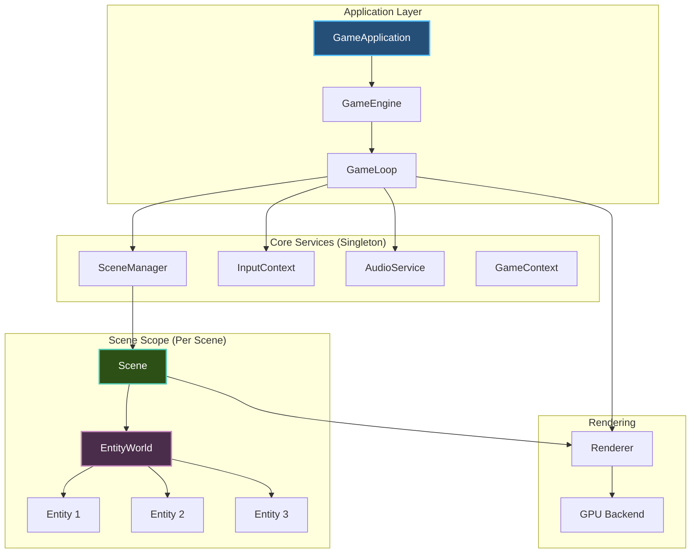
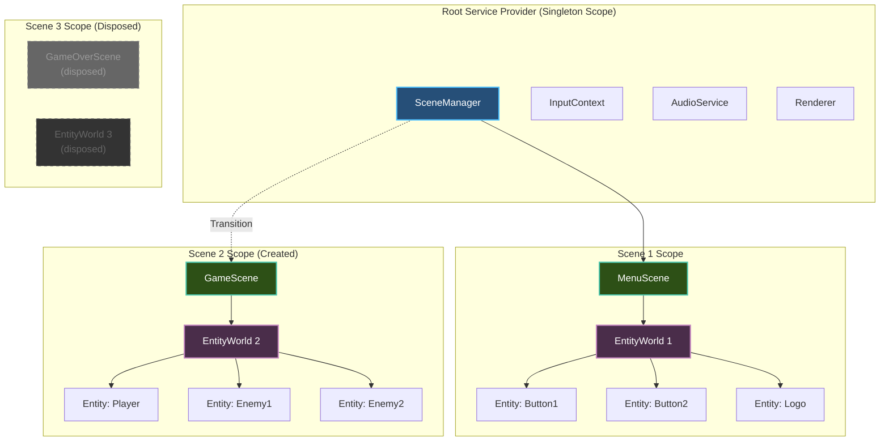
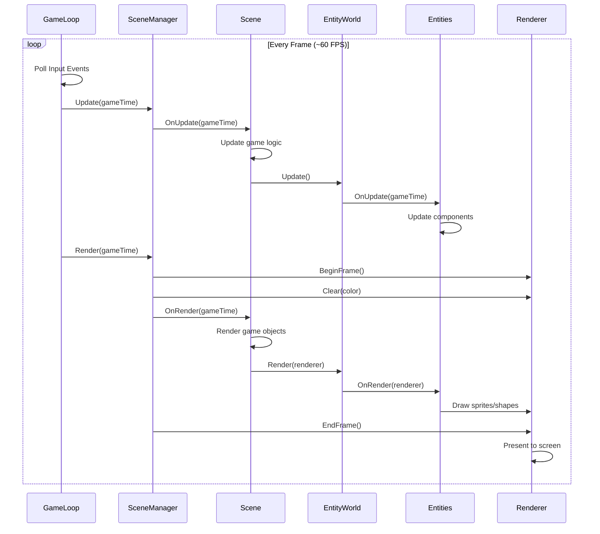
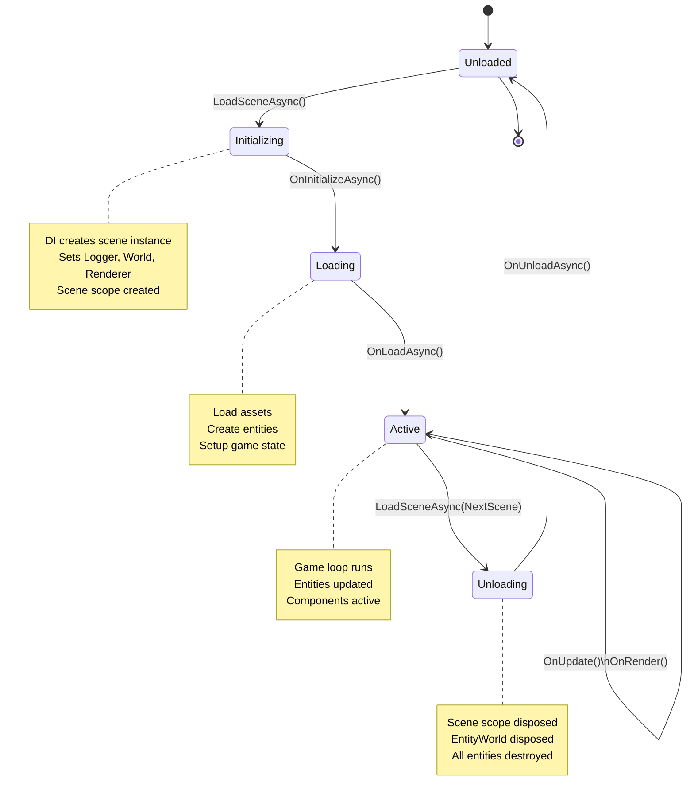

# Architecture

Brine2D's architecture is inspired by **ASP.NET Core**, bringing familiar patterns like dependency injection, configuration, and scoped services to game development.

## Overview

**Core principles:**

| Principle | Description |
|-----------|-------------|
| **Dependency Injection** | Services injected via constructor |
| **Scoped Services** | EntityWorld scoped per scene — automatically disposed on scene unload |
| **Configuration** | Options pattern (appsettings.json, environment variables) |
| **Hosting Model** | GameApplication builder (like WebApplication) |
| **Lifecycle Hooks** | Scene lifecycle (Initialize → Load → Update → Render → Unload) |

---

## High-Level Architecture



**Key concept:** SceneManager creates a **service scope per scene**, providing isolated EntityWorld instances.

---

## Dependency Injection Scoping

### Service Lifetimes

Brine2D uses **three DI lifetimes** (same as ASP.NET Core):

| Lifetime | Created | Destroyed | Use For |
|----------|---------|-----------|---------|
| **Singleton** | Once (app startup) | App shutdown | Input, Audio, SceneManager, Renderer |
| **Scoped** | Per scene | Scene unload | EntityWorld, scene-specific services |
| **Transient** | Per request | Immediately | Scenes, lightweight objects |

---

### Scoped EntityWorld

**Each scene gets its own isolated EntityWorld** - automatic cleanup!



Each scene scope provides:
- Automatic entity cleanup when the scene unloads
- Isolation between scenes
- A fresh `EntityWorld` with no leftover state

This mirrors ASP.NET's request scope — each HTTP request gets its own scope, and Brine2D scenes work the same way.

---

### How Scoping Works

#### Service Registration

```csharp
public static IServiceCollection AddBrine2D(
    this IServiceCollection services,
    Action<Brine2DOptions>? configure = null)
{
    // ✅ Singleton services (shared across all scenes)
    services.AddSingleton<ISceneManager, SceneManager>();
    services.AddSingleton<IInputContext, InputContext>();
    services.AddSingleton<IAudioService, AudioService>();
    services.AddSingleton<IRenderer, Renderer>();
    
    // ✅ Scoped services (per scene)
    services.AddScoped<IEntityWorld, EntityWorld>();
    
    // ✅ Transient services (per request)
    services.AddTransient<MenuScene>();
    services.AddTransient<GameScene>();
    
    return services;
}
```

#### Scene Loading (Creates Scope)

```csharp
public class SceneManager : ISceneManager
{
    private readonly IServiceProvider _serviceProvider;
    
    public async Task LoadSceneAsync<TScene>() where TScene : IScene
    {
        // ✅ Create new scene instance from DI (transient)
        var scene = _serviceProvider.GetRequiredService<TScene>();
        
        // ✅ Set framework properties
        if (scene is Scene concreteScene)
        {
            // Logger (typed per scene)
            var loggerFactory = _serviceProvider.GetRequiredService<ILoggerFactory>();
            concreteScene.Logger = loggerFactory.CreateLogger(typeof(TScene));
            
            // ✅ EntityWorld (scoped per scene - fresh instance!)
            concreteScene.World = _serviceProvider.GetRequiredService<IEntityWorld>();
            
            // Renderer (singleton - shared)
            concreteScene.Renderer = _serviceProvider.GetRequiredService<IRenderer>();
        }
        
        // Initialize scene
        await scene.InitializeAsync(cancellationToken);
        await scene.LoadAsync(cancellationToken);
        
        CurrentScene = scene;
    }
}
```

**Pattern:** When SceneManager resolves a scene from DI, it gets a **fresh EntityWorld instance** because it's registered as scoped!

---

## Component Architecture

### Scene Base Class

```csharp
public abstract class Scene : IScene
{
    // ✅ Framework properties (set by SceneManager)
    public ILogger Logger { get; internal set; } = null!;
    public IEntityWorld World { get; internal set; } = null!;
    public IRenderer Renderer { get; internal set; } = null!;
    
    // Constructor: ONLY inject YOUR services
    protected Scene(IInputContext input, IAudioService audio)
    {
        // Your dependencies here
    }
    
    // Lifecycle methods
    protected virtual Task OnInitializeAsync(CancellationToken ct) => Task.CompletedTask;
    protected virtual Task OnLoadAsync(CancellationToken ct) => Task.CompletedTask;
    protected virtual void OnUpdate(GameTime gameTime) { }
    protected virtual void OnRender(GameTime gameTime) { }
    protected virtual Task OnUnloadAsync(CancellationToken ct) => Task.CompletedTask;
}
```

**Pattern:** Framework properties injected via property injection (set by SceneManager), user dependencies via constructor injection.

---

### Entity-Component-System

```csharp
// Entity - container for components
public class Entity
{
    public Guid Id { get; }
    public string Name { get; set; }
    public IEntityWorld? World { get; internal set; }
    
    private readonly Dictionary<Type, Component> _components = new();
    
    // ✅ Lifecycle methods (optional)
    public virtual void OnInitialize() { }
    public virtual void OnUpdate(GameTime gameTime) 
    {
        // ✅ Automatically calls OnUpdate on all components
        foreach (var component in _components.Values)
        {
            if (component.IsEnabled)
            {
                component.OnUpdate(gameTime);
            }
        }
    }
    public virtual void OnRender(IRenderer renderer) { }
    public virtual void OnDestroy() { }
}

// Component - data + optional logic
public abstract class Component
{
    public Entity? Entity { get; internal set; }
    public bool IsEnabled { get; set; } = true;
    
    // ✅ Helper methods
    public T? GetComponent<T>() where T : Component => Entity?.GetComponent<T>();
    public T GetRequiredComponent<T>() where T : Component => Entity!.GetRequiredComponent<T>();
    
    // ✅ Lifecycle hooks
    protected internal virtual void OnAdded() { }
    protected internal virtual void OnRemoved() { }
    protected internal virtual void OnEnabled() { }
    protected internal virtual void OnDisabled() { }
    protected internal virtual void OnUpdate(GameTime gameTime) { }
}

// EntityWorld - manages entities (scoped per scene!)
public class EntityWorld : IEntityWorld, IDisposable
{
    private readonly List<Entity> _entities = new();
    private readonly IServiceProvider _serviceProvider;
    
    public IReadOnlyList<Entity> Entities => _entities.AsReadOnly();
    
    public Entity CreateEntity(string name = ")
    {
        var entity = new Entity { Name = name, World = this };
        _entities.Add(entity);
        entity.OnInitialize();
        return entity;
    }
    
    public void DestroyEntity(Entity entity)
    {
        entity.OnDestroy();
        _entities.Remove(entity);
    }
    
    // ✅ Automatic cleanup when scene unloads
    public void Dispose()
    {
        foreach (var entity in _entities.ToList())
        {
            DestroyEntity(entity);
        }
        _entities.Clear();
    }
}
```

---

## Game Loop

### Update-Render Loop



**Key concepts:**
- **Update** runs first (game logic)
- **Render** runs second (drawing)
- **Input** polled before update
- **Frame management** automatic (BeginFrame/EndFrame)

---

## Scene Lifecycle

### Complete Lifecycle



**Pattern:** Scene scope created on load, disposed on unload - all scoped services (EntityWorld) automatically cleaned up!

---

## Service Scope Lifecycle

### Scene Transition Example

```csharp
// Application startup - root scope created
var builder = GameApplication.CreateBuilder(args);

builder.Services.AddBrine2D(options =>
{
    options.Window.Title = "My Game";
});

// Register scenes
builder.AddScene<MenuScene>();
builder.AddScene<GameScene>();

var game = builder.Build();

// --- Application Running ---

// Load MenuScene - creates scope 1
await game.RunAsync<MenuScene>();

// MenuScene running
// - EntityWorld 1 created (scoped)
// - 100 UI entities created
// - InputContext shared (singleton)
// - Renderer shared (singleton)

// Transition to GameScene - disposes scope 1, creates scope 2
await sceneManager.LoadSceneAsync<GameScene>();

// ✅ MenuScene unloaded
//    - EntityWorld 1 disposed
//    - All 100 UI entities destroyed automatically
//    - No memory leaks!

// GameScene running
// - EntityWorld 2 created (scoped)
// - 500 game entities created
// - Fresh EntityWorld, can't access MenuScene entities
// - InputContext still shared (singleton)
// - Renderer still shared (singleton)

// Application shutdown - root scope disposed
// - All singletons disposed
// - Current scene unloaded
// - EntityWorld 2 disposed
// - All 500 game entities destroyed
```

**Pattern:** Each scene transition creates/destroys a scope, automatically cleaning up scoped services!

---

## System Registration

### Registering Services

```csharp
var builder = GameApplication.CreateBuilder(args);

// ✅ Singleton services (shared across all scenes)
builder.Services.AddSingleton<IGameStateService, GameStateService>();
builder.Services.AddSingleton<ISaveManager, SaveManager>();

// ✅ Scoped services (per scene)
builder.Services.AddScoped<ISceneSpecificService, SceneSpecificService>();

// ✅ Transient services (per request)
builder.Services.AddTransient<ITransientService, TransientService>();

// Register scenes
builder.AddScene<MenuScene>();
builder.AddScene<GameScene>();

var game = builder.Build();
await game.RunAsync<MenuScene>();
```

---

### Scene Service Resolution

```csharp
public class GameScene : Scene
{
    // ✅ YOUR services injected via constructor
    private readonly IInputContext _input;
    private readonly IAudioService _audio;
    private readonly IGameStateService _gameState;
    
    public GameScene(
        IInputContext input,
        IAudioService audio,
        IGameStateService gameState)
    {
        _input = input;
        _audio = audio;
        _gameState = gameState;
    }
    
    protected override Task OnLoadAsync(CancellationToken ct)
    {
        // ✅ Framework properties available automatically
        Logger.LogInformation("Loading game scene");
        
        // ✅ World is fresh and empty (scoped per scene)
        var player = World.CreateEntity("Player");
        player.AddComponent<TransformComponent>();
        
        Logger.LogInformation("Created {Count} entities", World.Entities.Count);
        
        return Task.CompletedTask;
    }
    
    protected override Task OnUnloadAsync(CancellationToken ct)
    {
        // ✅ No cleanup needed - World disposed automatically!
        return Task.CompletedTask;
    }
}
```

---

## Benefits of This Architecture

### 1. Testability

```csharp
// ✅ Easy to test - inject mocks
public class GameSceneTests
{
    [Fact]
    public async Task PlayerMovement_Works()
    {
        // Arrange
        var mockInput = new Mock<IInputContext>();
        var mockAudio = new Mock<IAudioService>();
        var mockWorld = new Mock<IEntityWorld>();
        
        var scene = new GameScene(
            mockInput.Object,
            mockAudio.Object);
        
        scene.World = mockWorld.Object; // Set framework property
        
        // Act
        await scene.LoadAsync(CancellationToken.None);
        scene.Update(new GameTime(0.016));
        
        // Assert
        mockWorld.Verify(w => w.CreateEntity("Player"), Times.Once);
    }
}
```

---

### 2. No Memory Leaks

```csharp
// ❌ Old way (manual cleanup)
public class MenuScene : Scene
{
    protected override Task OnUnloadAsync(CancellationToken ct)
    {
        // ❌ Manual cleanup - easy to forget!
        foreach (var entity in World.Entities.ToList())
        {
            World.DestroyEntity(entity);
        }
        return Task.CompletedTask;
    }
}

// ✅ New way (automatic cleanup)
public class MenuScene : Scene
{
    protected override Task OnUnloadAsync(CancellationToken ct)
    {
        // ✅ Nothing to do - World disposed automatically!
        return Task.CompletedTask;
    }
}
```

---

### 3. Scene Isolation

```csharp
// MenuScene
public class MenuScene : Scene
{
    protected override Task OnLoadAsync(CancellationToken ct)
    {
        // Create 100 UI entities
        for (int i = 0; i < 100; i++)
        {
            CreateMenuButton();
        }
        
        Logger.LogInformation("Menu has {Count} entities", World.Entities.Count); // 100
        
        return Task.CompletedTask;
    }
}

// GameScene (loaded after MenuScene)
public class GameScene : Scene
{
    protected override Task OnLoadAsync(CancellationToken ct)
    {
        // ✅ World is fresh - no leftover menu entities!
        Logger.LogInformation("Game world has {Count} entities", World.Entities.Count); // 0
        
        // Create game entities
        CreatePlayer();
        CreateEnemies();
        
        return Task.CompletedTask;
    }
}
```

---

### 4. Familiar Patterns

```csharp
// ASP.NET Core controller
public class WeatherController : ControllerBase
{
    // ✅ DI via constructor
    private readonly ILogger<WeatherController> _logger;
    private readonly IWeatherService _weather;
    
    public WeatherController(
        ILogger<WeatherController> logger,
        IWeatherService weather)
    {
        _logger = logger;
        _weather = weather;
    }
    
    [HttpGet]
    public async Task<IEnumerable<WeatherForecast>> Get()
    {
        _logger.LogInformation("Getting weather");
        return await _weather.GetForecastAsync();
    }
}

// Brine2D scene - SAME PATTERN!
public class GameScene : Scene
{
    // ✅ DI via constructor
    private readonly IInputContext _input;
    private readonly IAudioService _audio;
    
    // ✅ Framework properties (like ControllerBase.Request)
    // Logger, World, Renderer set automatically
    
    public GameScene(IInputContext input, IAudioService audio)
    {
        _input = input;
        _audio = audio;
    }
    
    protected override Task OnLoadAsync(CancellationToken ct)
    {
        Logger.LogInformation("Loading game");
        return Task.CompletedTask;
    }
}
```

---

## Summary

**Brine2D Architecture:**

| Layer | Lifetime | Purpose |
|-------|----------|---------|
| **Application** | Singleton | GameApplication, GameEngine, GameLoop |
| **Core Services** | Singleton | SceneManager, InputContext, AudioService, Renderer |
| **Scene Scope** | Scoped | EntityWorld (per scene) |
| **Scenes** | Transient | MenuScene, GameScene, etc. |
| **Entities** | Scoped | Lifetime bound to EntityWorld |

**Key benefits:**

| Benefit | Description |
|---------|-------------|
| **Familiar** | ASP.NET Core patterns (DI, configuration, hosting) |
| **Testable** | Constructor injection, easy to mock |
| **Automatic cleanup** | Scoped World per scene - no memory leaks! |
| **Isolated** | Scenes can't interfere with each other |
| **Flexible** | Hybrid ECS (components with methods + optional systems) |

**Pattern:** Brine2D brings web development best practices to game development!

---

## Next Steps

- **[Dependency Injection](dependency-injection.md)** - Deep dive into DI
- **[Scenes Concept](scenes.md)** - Scene lifecycle and property injection
- **[ECS Architecture](entity-component-system.md)** - Hybrid ECS explained
- **[Game Loop](game-loop.md)** - Update-render loop details
- **[Builder Pattern](builder-pattern.md)** - GameApplication builder

---

**Remember:** Each scene gets its own isolated EntityWorld that's automatically cleaned up when the scene unloads. No manual cleanup, no memory leaks! 🎮