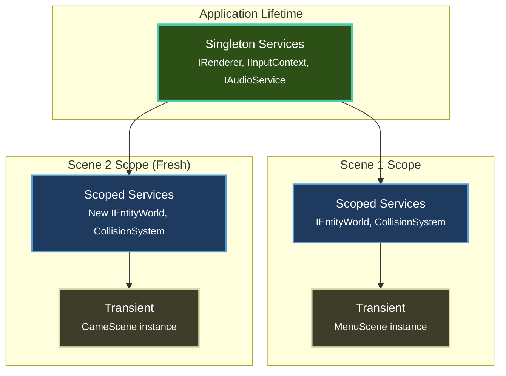
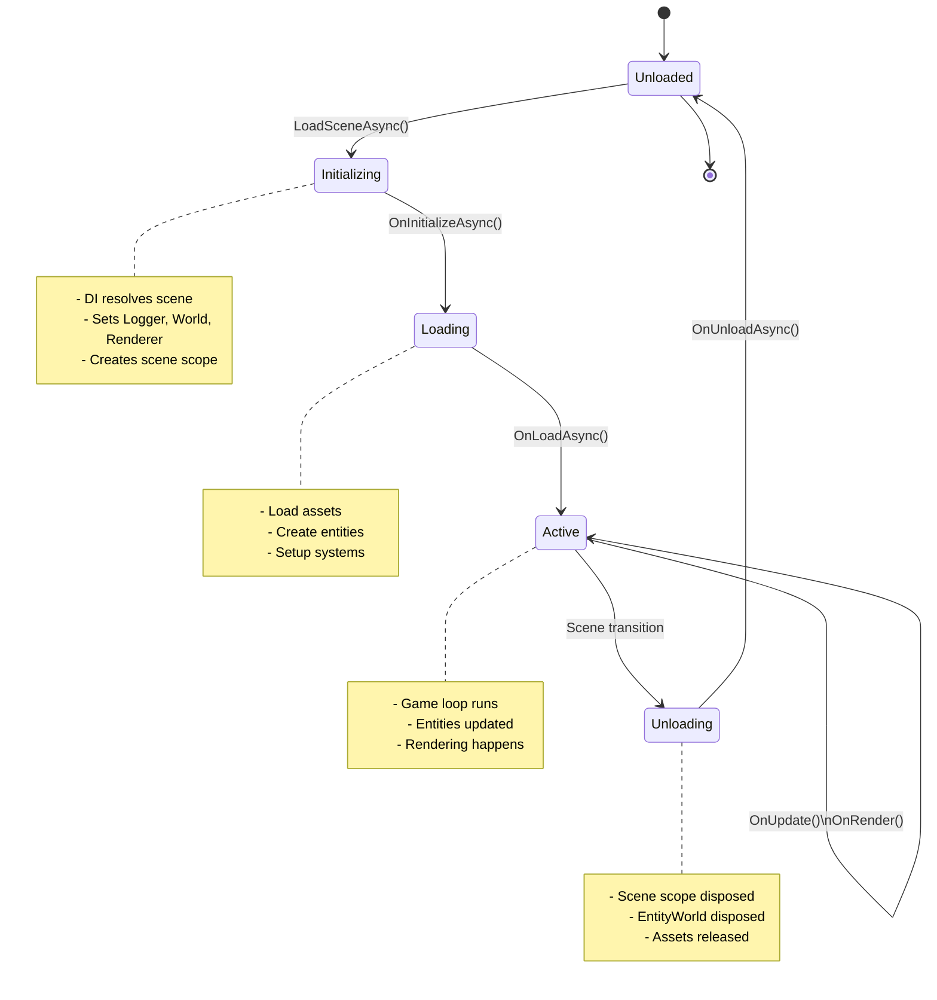

# Fundamentals

Understand the **core architecture and design patterns** that power Brine2D. This section is for developers who want to:

- 🏗️ Understand how Brine2D works internally
- 🔧 Extend the engine with custom systems
- 🎯 Build custom renderers or input backends
- 🚀 Optimize advanced scenarios
- 🤝 Contribute to Brine2D development

!!! info "New to Brine2D?"
    If you're just getting started, begin with [Get Started](../getting-started/index.md) instead. This section assumes you've already built games with Brine2D and want to go deeper.

---

## In This Section

### Core Architecture

| Topic | Description | Level |
|---|---|
| **[Architecture](architecture.md)** | High-level system design, ASP.NET-inspired patterns, and service scoping|
| **[Dependency Injection](dependency-injection.md)** | DI container internals, service lifetimes, and registration patterns|
| **[Scene Management](scene-management.md)** | How SceneManager works, scene scoping, and lifecycle implementation|

### Engine Systems

| Topic | Description | Level |
|---|---|
| **[Game Loop](game-loop.md)** | Frame timing, update/render loop, and execution order|
| **[Builder Pattern](builder-pattern.md)** | GameApplicationBuilder internals and service configuration|
| **[ECS Deep Dive](entity-component-system.md)** | Entity-Component-System architecture, queries, and performance|

---

## Quick Start Guide

### For Different Goals

=== "Understanding Architecture"

    **Goal:** Learn how Brine2D is structured internally
    
    **Path:**
    
    1. [Architecture](architecture.md) - Overall system design
    2. [Dependency Injection](dependency-injection.md) - Service container
    3. [Scene Management](scene-management.md) - Scene lifecycle
    
    **Time:** 2-3 hours reading

=== "Extending Brine2D"

    **Goal:** Build custom implementations (renderer, input, etc.)
    
    **Path:**
    
    1. [Architecture](architecture.md) - Understand abstractions
    2. [Dependency Injection](dependency-injection.md) - Service registration
    3. [Builder Pattern](builder-pattern.md) - Extension methods
    
    **Time:** 3-4 hours + implementation time

=== "Performance Optimization"

    **Goal:** Optimize advanced game scenarios
    
    **Path:**
    
    1. [Game Loop](game-loop.md) - Frame timing
    2. [ECS Deep Dive](entity-component-system.md) - Entity performance
    3. [Scene Management](scene-management.md) - Memory management
    
    **Time:** 2-3 hours + profiling time

=== "Contributing to Brine2D"

    **Goal:** Contribute to the engine codebase
    
    **Path:**
    
    1. [Architecture](architecture.md) - Design philosophy
    2. [Dependency Injection](dependency-injection.md) - Service patterns
    3. [Contributing Guide](../contributing/index.md) - Code style
    
    **Time:** 2-3 hours + contribution time

---

## Key Concepts

### Service Lifetimes

Understanding service lifetimes is **critical** for working with Brine2D's DI system:



**Key Insight:** Each scene gets its own **isolated scope** with fresh `IEntityWorld` instances. This prevents memory leaks and provides automatic cleanup.

→ [Learn more in Dependency Injection](dependency-injection.md#service-lifetimes)

---

### ASP.NET Core Parallels

Brine2D's architecture mirrors **ASP.NET Core** patterns you already know:

| ASP.NET Core | Brine2D | What It Does |
|---|---|
| `WebApplication.CreateBuilder()` | `GameApplication.CreateBuilder()` | Configure services |
| Controllers | Scenes | Handle logic |
| `ILogger<T>` | `ILogger<T>` | Structured logging |
| Request Scope | Scene Scope | Isolated per-request state |
| Middleware Pipeline | System Pipelines | Sequential processing |
| `appsettings.json` | `gamesettings.json` | Configuration |

**If you've built ASP.NET apps**, Brine2D will feel immediately familiar.

→ [Learn more in Architecture](architecture.md#aspnet-parallels)

---

### Scene Lifecycle

Understanding the **scene lifecycle** is essential for advanced scenarios:



→ [Learn more in Scene Management](scene-management.md#lifecycle)

---

## Comparison to Unity & Godot

If you're coming from other engines:

| Feature | Unity | Godot | Brine2D |
|---|---|
| **DI Container** | ❌ Manual | ❌ Manual | ✅ Built-in (ASP.NET style) |
| **Scene Isolation** | ⚠️ Manual cleanup | ⚠️ Manual cleanup | ✅ Automatic (scoped services) |
| **ECS** | ✅ DOTS (strict) | ❌ None | ✅ Hybrid (flexible) |
| **Configuration** | ⚠️ ScriptableObjects | ⚠️ .tres files | ✅ JSON with hot reload |
| **Async/Await** | ⚠️ Limited | ⚠️ Limited | ✅ First-class .NET async |

**Brine2D's advantage:** Leverages **battle-tested .NET patterns** from enterprise web development.

---

## Common Advanced Scenarios

### Custom Renderer Implementation

```csharp
public class MyCustomRenderer : IRenderer
{
    // Implement all IRenderer methods
    // Register in DI container
}

// In Program.cs
// builder.Services.AddSingleton<IRenderer, MyCustomRenderer>();
```

→ [Full guide in Architecture](architecture.md#custom-implementations)

---

### Custom Input Backend

```csharp
public class MyCustomInputService : IInputContext
{
    // Implement input polling
    // Register as singleton
}

// builder.Services.AddSingleton<IInputContext, MyCustomInputService>();
```

→ [Full guide in Dependency Injection](dependency-injection.md#custom-services)

---

### Scene-Specific Services

```csharp
// Register a scoped service (per-scene instance)
builder.Services.AddScoped<ILevelManager, LevelManager>();

public class GameScene : Scene
{
    private readonly ILevelManager _levelManager; // Fresh instance per scene
    
    public GameScene(ILevelManager levelManager)`n    {
        _levelManager = levelManager;
    }
}
```

→ [Full guide in Scene Management](scene-management.md#scoped-services)

---

## Best Practices

### ✅ DO

- **Read Architecture first** - Understand the big picture before diving into specifics
- **Use scoped services** - For scene-specific state (prevents leaks)
- **Follow ASP.NET patterns** - They're proven and familiar
- **Leverage async/await** - Don't block the game loop
- **Test with DI** - Mock dependencies for unit tests

### ❌ DON'T

- **Don't create singletons manually** - Use DI container
- **Don't share state between scenes** - Use scoped services
- **Don't block in OnUpdate** - Use async methods for I/O
- **Don't inject IServiceProvider** - Inject specific services
- **Don't fight the framework** - Follow the established patterns

---

## Performance Considerations

### Service Resolution Cost

**Service resolution is fast**, but not free:

| Lifetime | Resolution Cost | When to Use |
|---|---|
| **Singleton** | Once (cached) | Heavy objects, global state |
| **Scoped** | Once per scene (cached) | Scene-specific state |
| **Transient** | Every resolution | Lightweight, stateless |

**Rule of thumb:** Use the **most restrictive lifetime** that makes sense.

→ [Learn more in Dependency Injection](dependency-injection.md#performance)

---

### Memory Management

**Scene scoping** provides automatic memory management:

```csharp
public class GameScene : Scene
{
    protected override async Task OnLoadAsync(CancellationToken ct)
    {
        // Create 1000 entities
        for (int i = 0; i < 1000; i++)
        {
            World.CreateEntity($"Entity_{i}");
        }
    }
    
    // ✅ No cleanup needed - World disposed automatically when scene unloads!
    // All 1000 entities destroyed, no memory leaks
}
```

→ [Learn more in Scene Management](scene-management.md#memory-management)

---

## Related Resources

### Internal Documentation

- [Get Started](../getting-started/index.md) - New to Brine2D?
- [Tutorials](../tutorials/index.md) - Step-by-step learning
- [API Reference](../api/index.md) - Complete API docs
- [Samples](../samples/index.md) - Working examples

### External Resources

- [ASP.NET Core Fundamentals](https://learn.microsoft.com/en-us/aspnet/core/fundamentals/) - Learn the patterns Brine2D uses
- [Dependency Injection in .NET](https://learn.microsoft.com/en-us/dotnet/core/extensions/dependency-injection) - Microsoft's DI guide
- [Entity-Component-System](https://en.wikipedia.org/wiki/Entity_component_system) - ECS architecture overview

---

## Contributing

Found an issue or have a question about Brine2D's internals?

- 📝 [Open an issue](https://github.com/CrazyPickleStudios/Brine2D/issues)
- 💬 [Start a discussion](https://github.com/CrazyPickleStudios/Brine2D/discussions)
- 🤝 [Contributing guide](../contributing/index.md)

---

**Ready to dive deep?** Start with [Architecture](architecture.md) to understand Brine2D's design philosophy.
