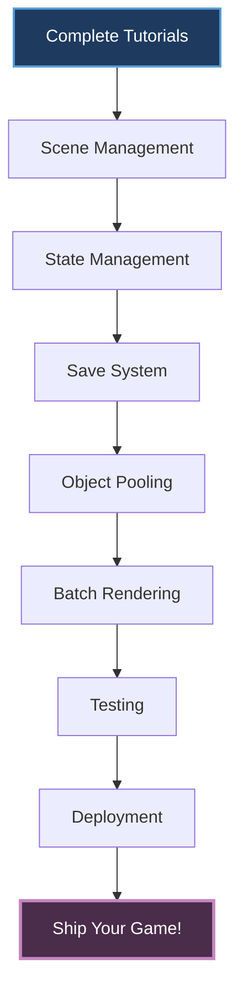

# Guides

Advanced topics and in-depth guides for building production-ready games with Brine2D. These guides assume you've completed the [tutorials](../tutorials/index.md) and understand the basics.

---

## What Are Guides?

**Tutorials:** Step-by-step instructions for beginners

**Guides:** Deep-dives into specific topics for experienced developers

**Use guides when:**
- You need advanced patterns
- You're optimizing performance
- You're building production games
- You want architectural best practices

---

## Available Guides

### Architecture & Patterns

| Guide | Topic |
|---|---|
| **[Scene Management](scene-management.md)** | Advanced scene patterns|
| **[State Management](state-management.md)** | Game state across scenes|
| **[Service Patterns](service-patterns.md)** | Custom services & DI|

---

### Performance

| Guide | Topic |
|---|---|
| **[Object Pooling](object-pooling.md)** | Reduce GC pressure|
| **[Batch Rendering](batch-rendering.md)** | Optimize draw calls|
| **[Memory Management](memory-management.md)** | Avoid allocations|

---

### Game Systems

| Guide | Topic |
|---|---|
| **[Physics Integration](physics-integration.md)** | Custom physics|
| **[Save System](save-system.md)** | Serialization & persistence|
| **[Achievement System](achievement-system.md)** | Unlockables & progress|

---

### Production

| Guide | Topic |
|---|---|
| **[Deployment](deployment.md)** | Publishing your game|
| **[Debugging](debugging.md)** | Advanced debugging|
| **[Testing](testing.md)** | Testing strategies|

---

## Scene Management

**Deep dive into advanced scene patterns.**

### Multiple Active Scenes

**Use case:** Persistent HUD + game scene

```csharp
public class SceneStack
{
    private readonly Stack<Scene> _scenes = new();
    
    public void Push(Scene scene)
    {
        _scenes.Push(scene);
        scene.Initialize();
    }
    
    public void Pop()
    {
        var scene = _scenes.Pop();
        scene.Unload();
    }
    
    public void Update(GameTime gameTime)
    {
        // Update all scenes in stack
        foreach (var scene in _scenes.Reverse())
        {
            scene.Update(gameTime);
        }
    }
}

// Usage
_sceneStack.Push(new GameScene());
_sceneStack.Push(new HUDScene());  // Overlays game scene
```

---

### Scene Data Passing

**Pattern 1: Singleton service**

```csharp
public class GameState
{
    public int Level { get; set; }
    public int Score { get; set; }
    public string PlayerName { get; set; } = ";
}

// Register
builder.Services.AddSingleton<GameState>();

// Scene 1: Set data
public class MenuScene : Scene
{
    private readonly GameState _state;
    
    public MenuScene(GameState state)
    {
        _state = state;
    }
    
    protected override void OnUpdate(GameTime gameTime)
    {
        if (_input.IsKeyPressed(Key.Enter))
        {
            _state.PlayerName = _nameInput.Text;
            _state.Level = 1;
            await _sceneManager.LoadSceneAsync<GameScene>();
        }
    }
}

// Scene 2: Read data
public class GameScene : Scene
{
    private readonly GameState _state;
    
    public GameScene(GameState state)
    {
        _state = state;
    }
    
    protected override Task OnLoadAsync(CancellationToken ct)
    {
        Logger.LogInformation("Loading level {Level} for {Player}", 
            _state.Level, _state.PlayerName);
        return Task.CompletedTask;
    }
}
```

[:octicons-arrow-right-24: Full Guide: Scene Management](scene-management.md)

---

## Object Pooling

**Reduce garbage collection pressure with object pooling.**

### Why Pool?

**Problem:**
```csharp
// ? Creates garbage every frame
protected override void OnUpdate(GameTime gameTime)
{
    if (_input.IsMouseButtonPressed(MouseButton.Left))
    {
        var bullet = new Bullet();  // Allocates memory
        bullet.Fire(_playerPosition);
    }
}
```

**Performance:** 60 bullets/sec = 3600 objects/min = frequent GC pauses

---

### Generic Pool Implementation

```csharp
public class ObjectPool<T> where T : new()
{
    private readonly Stack<T> _pool = new();
    private readonly Action<T>? _resetAction;
    
    public ObjectPool(int initialSize = 16, Action<T>? resetAction = null)
    {
        _resetAction = resetAction;
        
        for (int i = 0; i < initialSize; i++)
        {
            _pool.Push(new T());
        }
    }
    
    public T Get()
    {
        if (_pool.Count > 0)
            return _pool.Pop();
        
        return new T();  // Grow if needed
    }
    
    public void Return(T item)
    {
        _resetAction?.Invoke(item);
        _pool.Push(item);
    }
}
```

---

### Usage Example

```csharp
public class BulletManager
{
    private readonly ObjectPool<Bullet> _bulletPool;
    
    public BulletManager()
    {
        _bulletPool = new ObjectPool<Bullet>(
            initialSize: 100,
            resetAction: bullet => bullet.Reset()
        );
    }
    
    public void Fire(Vector2 position, Vector2 direction)
    {
        var bullet = _bulletPool.Get();  // Reuse
        bullet.Position = position;
        bullet.Direction = direction;
        bullet.OnDestroy += () => _bulletPool.Return(bullet);  // Auto-return
    }
}
```

**Result:** Zero allocations, no GC pauses!

[:octicons-arrow-right-24: Full Guide: Object Pooling](object-pooling.md)

---

## Save System

**Persist game data between sessions.**

### JSON Serialization

```csharp
public class SaveData
{
    public int Level { get; set; }
    public int Score { get; set; }
    public Vector2 PlayerPosition { get; set; }
    public List<string> UnlockedAchievements { get; set; } = new();
}

public class SaveSystem
{
    private readonly string _savePath;
    
    public SaveSystem()
    {
        var appData = Environment.GetFolderPath(
            Environment.SpecialFolder.ApplicationData);
        _savePath = Path.Combine(appData, "MyGame", "save.json");
    }
    
    public async Task SaveAsync(SaveData data)
    {
        Directory.CreateDirectory(Path.GetDirectoryName(_savePath)!);
        
        var json = JsonSerializer.Serialize(data, new JsonSerializerOptions
        {
            WriteIndented = true
        });
        
        await File.WriteAllTextAsync(_savePath, json);
    }
    
    public async Task<SaveData?> LoadAsync()
    {
        if (!File.Exists(_savePath))
            return null;
        
        var json = await File.ReadAllTextAsync(_savePath);
        return JsonSerializer.Deserialize<SaveData>(json);
    }
}
```

---

### Integration

```csharp
// Register
builder.Services.AddSingleton<SaveSystem>();

// Game scene
public class GameScene : Scene
{
    private readonly SaveSystem _saveSystem;
    
    public GameScene(SaveSystem saveSystem)
    {
        _saveSystem = saveSystem;
    }
    
    protected override async Task OnLoadAsync(CancellationToken ct)
    {
        // Load save
        var save = await _saveSystem.LoadAsync();
        if (save != null)
        {
            _level = save.Level;
            _score = save.Score;
            _playerPosition = save.PlayerPosition;
        }
    }
    
    public async Task SaveGameAsync()
    {
        var data = new SaveData
        {
            Level = _level,
            Score = _score,
            PlayerPosition = _playerPosition
        };
        
        await _saveSystem.SaveAsync(data);
    }
}
```

[:octicons-arrow-right-24: Full Guide: Save System](save-system.md)

---

## Batch Rendering

**Minimize draw calls for maximum performance.**

### Texture Atlas

```csharp
public class SpriteAtlas
{
    private readonly ITexture _atlasTexture;
    private readonly Dictionary<string, Rectangle> _regions;
    
    public ITexture Texture => _atlasTexture;
    
    public Rectangle GetRegion(string name)
    {
        return _regions[name];
    }
}

// Build at startup
public class AtlasBuilder
{
    public static async Task<SpriteAtlas> BuildAsync(
        IRenderer renderer,
        Dictionary<string, ITexture> sprites)
    {
        // Pack sprites into single texture (implementation omitted)
        var packed = PackTextures(sprites);
        
        return new SpriteAtlas(packed.Texture, packed.Regions);
    }
}
```

---

### Batch Drawing

```csharp
public class SpriteBatch
{
    private readonly List<DrawCommand> _commands = new();
    private SpriteAtlas? _currentAtlas;
    
    public void Draw(string spriteName, Vector2 position)
    {
        _commands.Add(new DrawCommand
        {
            SpriteName = spriteName,
            Position = position
        });
    }
    
    public void Flush(IRenderer renderer)
    {
        if (_currentAtlas == null) return;
        
        // Group by texture (atlas)
        var grouped = _commands.GroupBy(c => c.Atlas);
        
        foreach (var group in grouped)
        {
            // ONE draw call per atlas
            renderer.DrawBatch(group.Key.Texture, group.ToList());
        }
        
        _commands.Clear();
    }
}
```

**Result:** 1000 sprites = 1-2 draw calls instead of 1000!

[:octicons-arrow-right-24: Full Guide: Batch Rendering](batch-rendering.md)

---

## Testing Strategies

**Write testable game code.**

### Unit Testing Game Logic

```csharp
public class PlayerTests
{
    [Fact]
    public void TakeDamage_ReducesHealth()
    {
        var player = new Player { Health = 100 };
        
        player.TakeDamage(25);
        
        Assert.Equal(75, player.Health);
    }
    
    [Fact]
    public void TakeDamage_WhenHealthZero_PlayerDies()
    {
        var player = new Player { Health = 10 };
        var died = false;
        player.OnDeath += () => died = true;
        
        player.TakeDamage(10);
        
        Assert.True(died);
    }
}
```

---

### Integration Testing Scenes

```csharp
public class SceneTests
{
    [Fact]
    public async Task GameScene_LoadsWithoutCrashing()
    {
        var services = new ServiceCollection();
        services.AddSingleton<IInputContext>(new MockInputContext());
        services.AddSingleton<IAudioService>(new MockAudioService());
        
        var provider = services.BuildServiceProvider();
        var scene = ActivatorUtilities.CreateInstance<GameScene>(provider);
        
        await scene.LoadAsync(CancellationToken.None);
        
        Assert.NotNull(scene);
    }
}
```

[:octicons-arrow-right-24: Full Guide: Testing](testing.md)

---

## Deployment

**Publish your game for distribution.**

### Single-File Publish

```bash
# Windows
dotnet publish -c Release -r win-x64 \
    --self-contained \
    /p:PublishSingleFile=true \
    /p:IncludeNativeLibrariesForSelfExtract=true

# macOS
dotnet publish -c Release -r osx-x64 \
    --self-contained \
    /p:PublishSingleFile=true

# Linux
dotnet publish -c Release -r linux-x64 \
    --self-contained \
    /p:PublishSingleFile=true
```

**Output:** Single executable + assets folder

---

### Steam Distribution

```xml
<!-- YourGame.csproj -->
<PropertyGroup>
    <PublishDir>bin\Publish\Steam\$(RuntimeIdentifier)\</PublishDir>
    <IncludeNativeLibrariesForSelfExtract>true</IncludeNativeLibrariesForSelfExtract>
</PropertyGroup>

<Target Name="CopySteamFiles" AfterTargets="Publish">
    <Copy SourceFiles="steam_api64.dll" 
          DestinationFolder="$(PublishDir)" />
</Target>
```

[:octicons-arrow-right-24: Full Guide: Deployment](deployment.md)

---

## Guide Categories

### By Experience Level

| Level | Guides | Prerequisites |
|---|---|
| **Intermediate** | Scene Management, Save System, Deployment | Completed tutorials |
| **Advanced** | Object Pooling, Batch Rendering, Testing | Production experience |
| **Expert** | Service Patterns, Memory Management, Physics | Deep .NET knowledge |

---

### By Topic Area

| Area | Guides |
|------|--------|
| **Architecture** | Scene Management, State Management, Service Patterns |
| **Performance** | Object Pooling, Batch Rendering, Memory Management |
| **Game Systems** | Save System, Achievement System, Physics Integration |
| **Production** | Deployment, Debugging, Testing |

---

## How to Use Guides

### 1. Choose Your Focus

**Building a game?** Start with Scene Management and Save System

**Optimizing?** Jump to Object Pooling and Batch Rendering

**Shipping?** Read Deployment and Testing

---

### 2. Follow the Pattern

Each guide follows this structure:

1. **Problem statement** - What issue does this solve?
2. **Solution pattern** - Recommended approach
3. **Implementation** - Complete working code
4. **Best practices** - Tips and gotchas
5. **Examples** - Real-world usage

---

### 3. Adapt to Your Needs

**Guides are starting points, not rules.**

Modify patterns to fit your game's specific requirements.

---

## Learning Path

**Recommended guide reading order:**



**Time investment:** ~2-3 hours per guide

---

## Related Resources

### Documentation
- [Tutorials](../tutorials/index.md) - Learn the basics first
- [API Reference](../api/index.md) - Complete API docs
- [Samples](../samples/index.md) - Working examples
- [Performance](../performance/index.md) - Optimization techniques

### External
- [.NET Performance Tips](https://learn.microsoft.com/en-us/dotnet/core/performance/) - Microsoft docs
- [Game Programming Patterns](https://gameprogrammingpatterns.com/) - Free online book
- [Performance Best Practices](https://learn.microsoft.com/en-us/dotnet/framework/performance/) - .NET patterns

---

## Contributing Guides

**Want to write a guide?**

1. Pick a topic you've mastered
2. Fork the [documentation repo](https://github.com/CrazyPickleStudios/Brine2D-Documentation)
3. Follow the guide template
4. Submit pull request

**Good guide topics:**
- Patterns you've used in production
- Solutions to common problems
- Performance optimizations you've discovered

[:octicons-arrow-right-24: Contributing Guidelines](../contributing/index.md)

---

**Ready to level up?** Start with [Scene Management](scene-management.md) or choose a guide that fits your needs!
