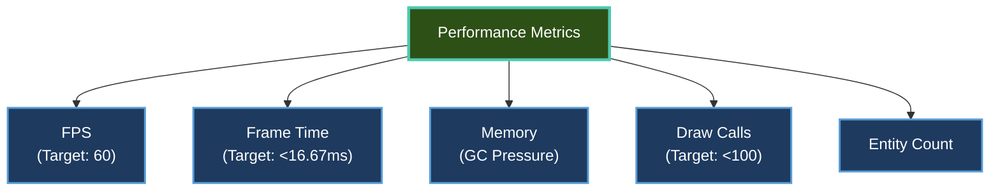

# Performance

Learn how to measure, analyze, and optimize the performance of your Brine2D games.

---

## Quick Start

```csharp
// Enable performance monitoring
var builder = GameApplication.CreateBuilder(args);

builder.Services.AddBrine2D(options => { ... });

// Add performance monitoring
builder.Services.AddPerformanceMonitoring(options =>
{
    options.EnableOverlay = true;
    options.ShowFPS = true;
    options.ShowFrameTime = true;
    options.ShowMemory = true;
    options.ShowDrawCalls = true;
});

var game = builder.Build();
await game.RunAsync<GameScene>();
```

**Press F3** to toggle the performance overlay in-game.

---

## Topics

| Guide | Description |
|---|---|
| **[Monitoring](monitoring.md)** | Built-in performance overlay and metrics|
| **[Optimization](optimization.md)** | Improve performance and reduce lag|

---

## Key Concepts

### Performance Overlay (v0.9.0+)

Built-in real-time performance monitoring:

```csharp
builder.Services.AddPerformanceMonitoring(options =>
{
    options.EnableOverlay = true;       // Show overlay
    options.Position = OverlayPosition.TopRight;
    options.ShowFPS = true;             // Frames per second
    options.ShowFrameTime = true;       // Frame duration (ms)
    options.ShowMemory = true;          // Memory usage
    options.ShowDrawCalls = true;       // Rendering stats
    options.ShowEntityCount = true;     // Active entities
});
```

**Keyboard shortcuts:**
- **F1** - Toggle overlay visibility
- **F3** - Toggle detailed stats

[:octicons-arrow-right-24: Learn more: Monitoring](monitoring.md)

---

### Performance Metrics



---

## Common Performance Issues

### Low FPS

**Symptom:** Game runs slower than 60 FPS

**Common causes:**
1. Too many draw calls
2. Heavy computation in OnUpdate()
3. Garbage collection pauses
4. Inefficient collision detection

**Solutions:**

```csharp
// 1. Reduce draw calls with texture atlasing
var atlas = await AtlasBuilder.BuildAtlasAsync(Renderer, sprites);
// Draw all sprites in 1-2 calls instead of hundreds

// 2. Optimize update loop
protected override void OnUpdate(GameTime gameTime)
{
    // Use cached queries (no allocation)
    foreach (var (transform, velocity) in _movingEntities)
    {
        transform.Position += velocity.Value * deltaTime;
    }
}

// 3. Use object pooling
var bullet = _bulletPool.Get();  // Reuse instead of new
```

[:octicons-arrow-right-24: Full guide: Optimization](optimization.md)

---

### Stuttering/Hitching

**Symptom:** Occasional frame drops, choppy movement

**Common causes:**
1. Garbage collection
2. Loading assets during gameplay
3. Large scene transitions
4. Synchronous I/O

**Solutions:**

```csharp
// Preload assets
protected override async Task OnLoadAsync(CancellationToken ct)
{
    // Load all assets upfront
    _sprites = await LoadAllSpritesAsync(ct);
    _sounds = await LoadAllSoundsAsync(ct);
}

// Use object pooling
private ObjectPool<Bullet> _bulletPool;

// Avoid allocations in update
private Vector2 _reusableVector;  // Reuse instead of new
```

---

### High Memory Usage

**Symptom:** Memory usage grows over time

**Common causes:**
1. Memory leaks (static references)
2. Not unloading assets
3. Too many entities
4. Large textures

**Solutions:**

```csharp
// Unload assets when scene ends
protected override Task OnUnloadAsync(CancellationToken ct)
{
    _audio.StopAllSounds();
    _audio.StopMusic();
    
    // Textures unloaded automatically with scene
    return Task.CompletedTask;
}

// Don't store entities in static fields
// ❌ Bad
public static Entity GlobalPlayer;

// ✅ Good
private Entity? _player;  // Instance field
```

---

## Optimization Strategies

### 1. Texture Atlasing

**Problem:** Each sprite = 1 draw call (expensive!)

**Solution:** Pack sprites into atlas = 1 draw call for all

```csharp
// Without atlas: 100 draw calls
for (int i = 0; i < 100; i++)
{
    Renderer.DrawTexture(_sprites[i], x[i], y[i]);
}

// With atlas: 1-2 draw calls
var atlas = await AtlasBuilder.BuildAtlasAsync(Renderer, _sprites);
Renderer.DrawTexture(atlas.AtlasTexture, ...);  // All sprites in one call
```

**Result:** 90-99% fewer draw calls, 10x+ better performance

[:octicons-arrow-right-24: Learn more: Texture Atlasing](../rendering/texture-atlasing.md)

---

### 2. Cached Queries

**Problem:** Query allocates every frame

**Solution:** Create once, reuse

```csharp
// ❌ Bad - allocates every frame
protected override void OnUpdate(GameTime gameTime)
{
    foreach (var entity in World.Query<TransformComponent, VelocityComponent>().Execute())
    {
        // Allocates new query each frame
    }
}

// ✅ Good - cached query
private CachedQuery<TransformComponent, VelocityComponent> _movingEntities;

protected override Task OnLoadAsync(CancellationToken ct)
{
    _movingEntities = World.CreateCachedQuery<TransformComponent, VelocityComponent>();
    return Task.CompletedTask;
}

protected override void OnUpdate(GameTime gameTime)
{
    foreach (var (transform, velocity) in _movingEntities)
    {
        // Zero allocation!
    }
}
```

[:octicons-arrow-right-24: Learn more: ECS Queries](../ecs/queries.md)

---

### 3. Object Pooling

**Problem:** Creating/destroying objects causes GC pressure

**Solution:** Reuse objects from pool

```csharp
public class BulletPool
{
    private Queue<Bullet> _pool = new();
    
    public Bullet Get()
    {
        if (_pool.Count > 0)
            return _pool.Dequeue();  // Reuse
        else
            return new Bullet();  // Create if needed
    }
    
    public void Return(Bullet bullet)
    {
        bullet.Reset();
        _pool.Enqueue(bullet);  // Return to pool
    }
}

// Usage
var bullet = _bulletPool.Get();  // ✅ Reuse
// ... use bullet ...
_bulletPool.Return(bullet);  // ✅ Return for reuse
```

---

### 4. Spatial Partitioning

**Problem:** Collision checks all vs all = O(n²)

**Solution:** Only check nearby objects

```csharp
// ❌ Bad - O(n²)
foreach (var a in _allEntities)
{
    foreach (var b in _allEntities)
    {
        if (CheckCollision(a, b)) { }
    }
}

// ✅ Good - spatial grid
var grid = new SpatialGrid(cellSize: 100);
foreach (var entity in _entities)
{
    grid.Add(entity);
}

foreach (var entity in _entities)
{
    var nearby = grid.GetNearby(entity);  // Only nearby entities
    foreach (var other in nearby)
    {
        if (CheckCollision(entity, other)) { }
    }
}
```

---

### 5. Limit Entity Count

**Problem:** Too many entities = slow update loop

**Solution:** Cull off-screen or distant entities

```csharp
protected override void OnUpdate(GameTime gameTime)
{
    // Only update entities near camera
    var cameraViewport = GetCameraViewport();
    
    foreach (var entity in World.Entities)
    {
        var transform = entity.GetComponent<TransformComponent>();
        
        if (IsInViewport(transform.Position, cameraViewport))
        {
            entity.OnUpdate(gameTime);  // Only update visible
        }
    }
}
```

---

## Profiling Tools

### Built-In Performance Overlay

```csharp
// F3 to toggle overlay showing:
// - FPS
// - Frame time
// - Draw calls
// - Memory (GC generations)
// - Entity count
```

---

### .NET Profilers

| Tool | Platform | Use For |
|---|---|
| **dotTrace** | Windows/macOS | CPU profiling |
| **dotMemory** | Windows/macOS | Memory profiling |
| **PerfView** | Windows | CPU/GC analysis (free) |
| **Rider Profiler** | Windows/macOS/Linux | Integrated profiling |

---

## Best Practices

### ✅ DO

1. **Monitor early** - Enable overlay from day 1
2. **Profile before optimizing** - Measure first
3. **Use texture atlasing** - Batch sprite rendering
4. **Cache queries** - Zero allocation
5. **Preload assets** - Don't load in OnUpdate()

```csharp
// ✅ Good performance pattern
protected override async Task OnLoadAsync(CancellationToken ct)
{
    // Preload everything
    _sprites = await LoadSpritesAsync(ct);
    _atlas = await BuildAtlasAsync(_sprites, ct);
    
    // Create cached queries
    _movingEntities = World.CreateCachedQuery<TransformComponent, VelocityComponent>();
}

protected override void OnUpdate(GameTime gameTime)
{
    // Zero allocation update loop
    foreach (var (transform, velocity) in _movingEntities)
    {
        transform.Position += velocity.Value * (float)gameTime.DeltaTime;
    }
}
```

---

### ❌ DON'T

1. **Don't optimize prematurely** - Measure first
2. **Don't allocate in update loop** - Use pooling/caching
3. **Don't load assets in OnUpdate()** - Preload in OnLoadAsync()
4. **Don't check all vs all** - Use spatial partitioning
5. **Don't ignore the profiler** - Data beats intuition

```csharp
// ❌ Bad performance pattern
protected override void OnUpdate(GameTime gameTime)
{
    // Allocation every frame
    var query = World.Query<TransformComponent>().Execute();  // Allocates
    
    // Loading in update
    var texture = await _assets.GetOrLoadTextureAsync("sprite.png");  // Lag!
    
    // All vs all collision
    foreach (var a in _entities)
    {
        foreach (var b in _entities)  // O(n²) - very slow!
        {
            CheckCollision(a, b);
        }
    }
}
```

---

## Troubleshooting

### "FPS drops to 30"

**Cause:** V-Sync limiting to half refresh rate

**Solution:** Check V-Sync settings

```csharp
builder.Configure(options =>`n{`n    options.Rendering.VSync = true;`n});
```

---

### "Memory keeps growing"

**Cause:** Memory leak (static references)

**Solution:** Check for static entity references

```csharp
// ❌ Prevents garbage collection
public static Entity Player;
public static List<Entity> AllEnemies;

// ✅ Instance fields - cleaned up with scene
private Entity? _player;
private List<Entity> _enemies = new();
```

---

### "Stuttering every few seconds"

**Cause:** Garbage collection pauses

**Solutions:**

1. Enable GC stats in overlay (F3)
2. Reduce allocations (object pooling)
3. Increase Gen0 threshold (advanced)

```csharp
// Check GC stats
Logger.LogInformation("Gen0: {Gen0}, Gen1: {Gen1}, Gen2: {Gen2}",
    GC.CollectionCount(0),
    GC.CollectionCount(1),
    GC.CollectionCount(2));
```

---

## Performance Targets

| Metric | Target | Acceptable | Poor |
|---|---|
| **FPS** | 60 | 45-60 | <45 |
| **Frame Time** | <16.67ms | <22ms | >22ms |
| **Draw Calls** | <50 | <100 | >100 |
| **Memory (GC)** | <100 MB | <200 MB | >500 MB |
| **Entity Count** | <1000 | <5000 | >5000 |

---

## Related Topics

- [Monitoring](monitoring.md) - Performance overlay
- [Optimization](optimization.md) - Optimization techniques
- [Texture Atlasing](../rendering/texture-atlasing.md) - Reduce draw calls
- [ECS Queries](../ecs/queries.md) - Cached queries
- [Multi-Threading](../ecs/multi-threading.md) - Parallel processing

---

**Ready to optimize?** Start with [Monitoring](monitoring.md) to measure current performance!
