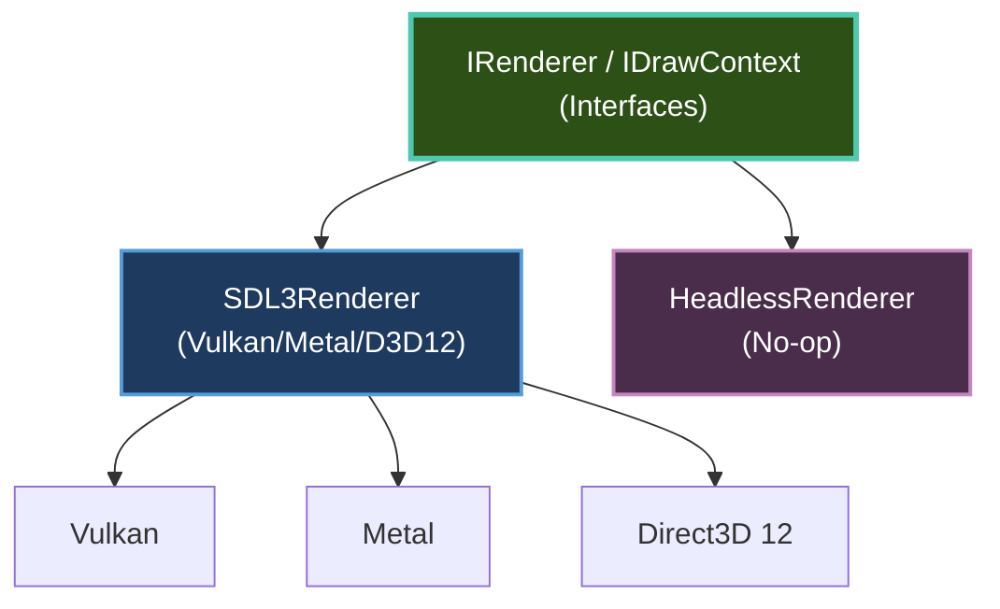

# Rendering Architecture

Brine2D uses a single, modern GPU-accelerated renderer built on the **SDL3 GPU API**. The engine automatically selects the best graphics backend for your platform - Vulkan, Direct3D 12, or Metal - so you can focus on your game.

---

## Overview

| Component | Description |
|-----------|-------------|
| **SDL3Renderer** | GPU-accelerated renderer (Vulkan / Metal / D3D12) |
| **HeadlessRenderer** | No-op renderer for servers and automated testing |
| **IRenderer** | Full rendering interface (lifecycle, render targets, state) |
| **IDrawContext** | Drawing-only interface (textures, shapes, text) |

---

## Architecture



**Default:** SDL3 GPU renderer with automatic backend selection.

---

## GPU Driver Selection

SDL3 automatically selects the best available GPU driver for your platform. You can override this with `PreferredGPUDriver`:

```csharp
builder.Configure(options =>
{
    options.Rendering.PreferredGPUDriver = GPUDriver.Vulkan; // Force Vulkan
});
```

### Available Drivers

| Driver | Platforms | Notes |
|--------|-----------|-------|
| `GPUDriver.Auto` | All | **Default** - SDL3 picks the best option |
| `GPUDriver.Vulkan` | Windows, Linux, Android | Cross-platform, high performance |
| `GPUDriver.D3D12` | Windows | Preferred on Windows 10+ |
| `GPUDriver.Metal` | macOS, iOS | Required on Apple platforms |

---

## Headless Mode

For dedicated servers or automated testing, enable headless mode to skip window creation, input, audio, and GPU initialization:

```csharp
builder.Configure(options =>
{
    options.Headless = true;
});
```

In headless mode:

- All draw calls are silently ignored
- `Width` and `Height` return `1` by default (prevents division-by-zero)
- `CreateRenderTarget` throws `NotSupportedException` (no GPU available)
- `MeasureText` returns rough character-count estimates

---

## Interfaces

### IRenderer

The full rendering interface used by the framework. Extends `IDrawContext` with lifecycle management, render targets, scissor rects, and viewport state.

Scenes access the renderer through the `Renderer` framework property - no injection needed:

```csharp
protected override void OnRender(GameTime gameTime)
{
    Renderer.ClearColor = Color.CornflowerBlue;
    Renderer.DrawTexture(_sprite, 100, 200);
}
```

### IDrawContext

A focused interface for consumers that only need drawing operations. Prefer this when you don't need render targets or lifecycle control:

```csharp
public class HudRenderer
{
    private readonly IDrawContext _draw;

    public HudRenderer(IDrawContext draw) => _draw = draw;

    public void Render()
    {
        _draw.DrawText("Score: 1000", 10, 10, Color.White);
        _draw.DrawRectangleFilled(10, 40, 200, 20, Color.DarkGray);
        _draw.DrawRectangleFilled(10, 40, 150, 20, Color.Green);
    }
}
```

---

## Configuration

### Basic Setup

```csharp
var builder = GameApplication.CreateBuilder(args);

builder.Configure(options =>
{
    options.Window.Title = "My Game";
    options.Window.Width = 1280;
    options.Window.Height = 720;
    options.Rendering.VSync = true;
});

builder.AddScene<GameScene>();

await using var game = builder.Build();
await game.RunAsync<GameScene>();
```

### Window Options

| Property | Default | Description |
|----------|---------|-------------|
| `Window.Title` | `"Brine2D Game"` | Window title |
| `Window.Width` | `1280` | Window width in pixels |
| `Window.Height` | `720` | Window height in pixels |
| `Window.Fullscreen` | `false` | Start in fullscreen |
| `Window.Resizable` | `true` | Allow user resizing |
| `Window.Maximized` | `false` | Start maximized |
| `Window.Borderless` | `false` | Remove window decorations |

### Rendering Options

| Property | Default | Description |
|----------|---------|-------------|
| `Rendering.VSync` | `true` | Sync with display refresh rate |
| `Rendering.PreferredGPUDriver` | `Auto` | GPU backend selection |
| `Rendering.TargetFPS` | `0` | Manual FPS cap (0 = use VSync / uncapped) |
| `Rendering.MaxDeltaTimeMs` | `100` | Clamp frame delta to prevent runaway updates |

---

## Platform Support

| Platform | GPU Backend | Status |
|----------|-------------|--------|
| **Windows 10+** | D3D12 / Vulkan | ✅ Supported |
| **Linux** | Vulkan | ✅ Supported |
| **macOS 10.14+** | Metal | ✅ Supported |
| **iOS** | Metal | ✅ Supported |
| **Android** | Vulkan | ✅ Supported |

---

## Troubleshooting

### GPU renderer not starting

**Symptom:** Error on startup or crash.

**Solutions:**

1. **Update graphics drivers** - SDL3 GPU API requires recent drivers
2. **Try a different GPU driver:**
   ```csharp
   options.Rendering.PreferredGPUDriver = GPUDriver.Vulkan;
   ```
3. **Check platform requirements:**
   - Windows 10+ for D3D12
   - macOS 10.14+ for Metal
   - Vulkan drivers on Linux

---

### Nothing renders (black screen)

**Checklist:**

1. ✅ Is `OnRender()` being called?
2. ✅ Is the texture loaded (not null)?
3. ✅ Are coordinates within the viewport?
4. ✅ Is the texture's `IsLoaded` property `true`?
5. ✅ Is alpha > 0 in the draw color?

---

## Next Steps

- **[GPU Renderer Deep Dive](gpu-renderer.md)** - Render targets, scissor rects, blend modes, text
- **[Sprites & Textures](sprites.md)** - Load and draw images
- **[Drawing Primitives](primitives.md)** - Lines, rectangles, circles
- **[Post-Processing](post-processing.md)** - Off-screen rendering and effects
