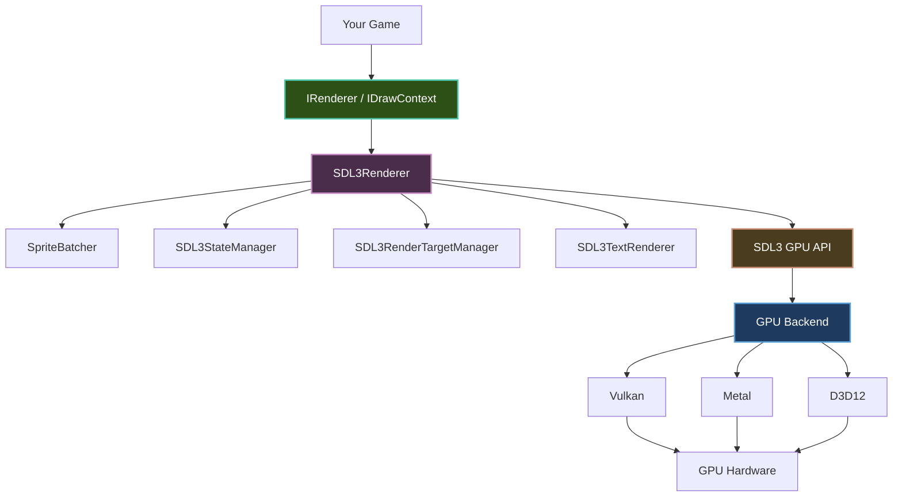

# GPU Renderer

The GPU renderer (`SDL3Renderer`) is Brine2D's rendering backend, built on the **SDL3 GPU API**. It provides hardware-accelerated 2D rendering with automatic sprite batching, render targets, scissor clipping, and blend modes.

---

## Architecture



**Key components:**

| Component | Responsibility |
|-----------|---------------|
| **SpriteBatcher** | Sorts and batches draw calls by texture, blend mode, and layer |
| **SDL3StateManager** | Tracks GPU state (scissor, blend, pipeline) to minimize redundant calls |
| **SDL3RenderTargetManager** | Manages render targets and the push/pop stack |
| **SDL3TextRenderer** | Font atlas management and text layout |

**Rendering flow:**

1. Your game calls `IRenderer` / `IDrawContext` methods
2. `SDL3Renderer` translates to GPU commands
3. SDL3 GPU API manages the backend (Vulkan / Metal / D3D12)
4. Commands execute on GPU hardware
5. Results are presented to the screen

---

## Configuration

```csharp
builder.Configure(options =>
{
    options.Window.Title = "My Game";
    options.Window.Width = 1280;
    options.Window.Height = 720;
    options.Rendering.VSync = true;
    options.Rendering.PreferredGPUDriver = GPUDriver.Auto; // Default
});
```

[:octicons-arrow-right-24: Full configuration reference](choosing-renderer.md#configuration)

---

## Render Targets

Render targets allow off-screen rendering - draw to a texture, then use that texture in subsequent draws.

### Creating a Render Target

`CreateRenderTarget` is **synchronous** and returns an `IRenderTarget`:

```csharp
IRenderTarget minimap = Renderer.CreateRenderTarget(256, 256);
```

!!! warning
    `CreateRenderTarget` throws `NotSupportedException` in [headless mode](choosing-renderer.md#headless-mode) (no GPU available).

---

### Set/Get Pattern

For simple cases, set the render target directly:

```csharp
// Render to target
Renderer.SetRenderTarget(minimap);
RenderMinimapView();

// Render back to screen
Renderer.SetRenderTarget(null);
Renderer.DrawTexture(minimap.Texture, 10, 10);
```

---

### Push/Pop Pattern (Recommended)

For nested render-to-texture operations, use the stack-based API:

```csharp
// Draw scene to off-screen target
Renderer.PushRenderTarget(offscreen);
RenderScene();
Renderer.PopRenderTarget();

// Draw the result to screen
Renderer.DrawTexture(offscreen.Texture, 0, 0);
```

Push/Pop is safer for nested operations - each `Pop` restores the previous target automatically:

```csharp
Renderer.PushRenderTarget(outerTarget);
RenderBackground();

    Renderer.PushRenderTarget(innerTarget);
    RenderOverlay();
    Renderer.PopRenderTarget(); // Restores outerTarget

RenderForeground();
Renderer.PopRenderTarget(); // Restores screen (null)
```

!!! tip
    Unmatched push/pop calls are caught at frame boundaries with diagnostic warnings.

---

### Render Target Lifecycle

- Render targets implement `IDisposable` - dispose them when no longer needed
- Render targets are fixed-size and do not resize with the window
- The internal post-processing render targets resize automatically

```csharp
private IRenderTarget? _offscreen;

protected override async Task OnLoadAsync(CancellationToken ct, IProgress<float>? progress = null)
{
    _offscreen = Renderer.CreateRenderTarget(Renderer.Width, Renderer.Height);
}

protected override void OnExit()
{
    _offscreen?.Dispose();
    _offscreen = null;
}
```

---

## Scissor Rects

Scissor rectangles clip all rendering to a specific screen-space region. Anything drawn outside the scissor rect is discarded.

### Basic Usage

```csharp
// Clip to a 200×200 region
Renderer.SetScissorRect(new Rectangle(10, 10, 200, 200));
Renderer.DrawTexture(largeTexture, 0, 0); // Only the part inside the rect is visible

// Disable clipping
Renderer.SetScissorRect(null);
```

---

### Push/Pop for Nested Clipping

When rendering UI hierarchies, child elements should be clipped to parent bounds. `PushScissorRect` automatically **intersects** with the current scissor rect:

```csharp
// Outer panel
Renderer.PushScissorRect(panelBounds);
RenderPanel();

    // Inner scroll view - clipped to both panel AND scroll bounds
    Renderer.PushScissorRect(scrollViewBounds);
    RenderScrollContent();
    Renderer.PopScissorRect();

Renderer.PopScissorRect();
```

!!! note
    Scissor rects are in **screen coordinates** and are not affected by camera transforms. Negative dimensions throw `ArgumentException`. The rect is clamped to the current render target (or viewport) bounds.

---

## Blend Modes

Control how pixels combine when drawing on top of existing content:

```csharp
Renderer.SetBlendMode(BlendMode.Additive);
Renderer.DrawTexture(_glowEffect, position);

Renderer.SetBlendMode(BlendMode.Alpha); // Restore default
```

### Available Modes

| Mode | Formula | Use Case |
|------|---------|----------|
| `BlendMode.Alpha` | `Src × SrcA + Dst × (1 − SrcA)` | **Default** - sprites, UI |
| `BlendMode.Additive` | `Src + Dst` | Fire, explosions, lights |
| `BlendMode.Multiply` | `Src × Dst` | Shadows, darkening |
| `BlendMode.None` | `Src` | Opaque objects |

The default blend mode is `BlendMode.Alpha` and resets each frame.

---

## Render Layers

Render layers control draw ordering when sprites are submitted through the `SpriteBatcher`:

```csharp
Renderer.SetRenderLayer(0);    // Background
Renderer.DrawTexture(_background, 0, 0);

Renderer.SetRenderLayer(128);  // Default layer - game objects
Renderer.DrawTexture(_player, _playerPos);

Renderer.SetRenderLayer(255);  // Foreground / UI
Renderer.DrawText("Score: 1000", 10, 10, Color.White);
```

!!! note
    Direct draw calls are rendered in submission order regardless of the active layer. Layers affect ordering only through the sprite batching system.

The default render layer is `128` and resets each frame.

---

## Text Rendering

### Basic Text

```csharp
Renderer.DrawText("Hello, Brine2D!", 10, 10, Color.White);
```

---

### Advanced Text with Options

Use `TextRenderOptions` for rich formatting:

```csharp
Renderer.DrawText("Styled Text", 100, 100, new TextRenderOptions
{
    Color = Color.Gold,
    FontSize = 24f,
    MaxWidth = 400f,                         // Word wrap at 400px
    HorizontalAlign = TextAlignment.Center,
    LineSpacing = 1.5f,
    ShadowOffset = new Vector2(2, 2),
    ShadowColor = new Color(0, 0, 0, 128),
    OutlineThickness = 1f,
    OutlineColor = Color.Black
});
```

---

### Measuring Text

Measure text dimensions for layout calculations:

```csharp
Vector2 size = Renderer.MeasureText("Hello!", fontSize: 24f);
float width = size.X;
float height = size.Y;

// With full options
Vector2 wrappedSize = Renderer.MeasureText("Long text...", new TextRenderOptions
{
    FontSize = 16f,
    MaxWidth = 200f
});
```

---

### Custom Fonts

```csharp
IFont customFont = await _assets.GetOrLoadFontAsync("assets/fonts/pixel.ttf", 16, ct);
Renderer.SetDefaultFont(customFont);
```

---

### TextRenderOptions Reference

| Property | Default | Description |
|----------|---------|-------------|
| `Color` | `White` | Default text color |
| `Font` | `null` | Font (null = renderer default) |
| `FontSize` | `16f` | Base size in points |
| `MaxWidth` | `null` | Word wrap width (null = no wrap) |
| `MaxHeight` | `null` | Vertical constraint (null = none) |
| `HorizontalAlign` | `Left` | `Left`, `Center`, `Right` |
| `VerticalAlign` | `Top` | `Top`, `Middle`, `Bottom` |
| `LineSpacing` | `1.2f` | Line spacing multiplier |
| `ParseMarkup` | `false` | Parse BBCode-style markup tags |
| `MarkupParser` | `null` | Custom markup parser |
| `ShadowOffset` | `null` | Shadow offset (null = no shadow) |
| `ShadowColor` | `(0,0,0,128)` | Shadow color |
| `OutlineThickness` | `0f` | Outline width in pixels (0 = none) |
| `OutlineColor` | `Black` | Outline color |

---

## Platform-Specific Notes

### Windows

- **GPU Backend:** Direct3D 12 (preferred) or Vulkan
- **Requirements:** Windows 10+, modern GPU, updated drivers

### Linux

- **GPU Backend:** Vulkan
- **Requirements:** Vulkan-capable GPU, Mesa 20.0+ or proprietary drivers

### macOS

- **GPU Backend:** Metal
- **Requirements:** macOS 10.14+ (all modern Macs support Metal)

---

## Performance Tips

1. **Batch by texture** - draw all sprites using the same texture together
2. **Use texture atlasing** - fewer texture switches means better batching
3. **Minimize render target switches** - each switch flushes the current batch
4. **Use scissor rects** for UI clipping instead of manual bounds checking
5. **Press F3** to toggle the performance overlay (FPS, draw calls, memory)

---

## Summary

| Feature | Details |
|---------|---------|
| **Backend** | SDL3 GPU API (Vulkan / Metal / D3D12) |
| **Batching** | Automatic sprite batching |
| **Render Targets** | Synchronous creation, push/pop stack |
| **Scissor Rects** | Nested clipping with auto-intersection |
| **Blend Modes** | Alpha, Additive, Multiply, None |
| **Render Layers** | 0–255 for draw ordering |
| **Text** | Basic + rich options (wrap, align, shadow, outline) |
| **VSync** | Enabled by default |

---

## Next Steps

- **[Rendering Architecture](choosing-renderer.md)** - Interfaces, headless mode, driver selection
- **[Sprites & Textures](sprites.md)** - Loading and drawing images
- **[Drawing Primitives](primitives.md)** - Lines, rectangles, circles
- **[Post-Processing](post-processing.md)** - Off-screen rendering and effects
- **[Cameras](cameras.md)** - Camera movement and zoom
- **[Performance Optimization](../performance/optimization.md)** - Optimization techniques
