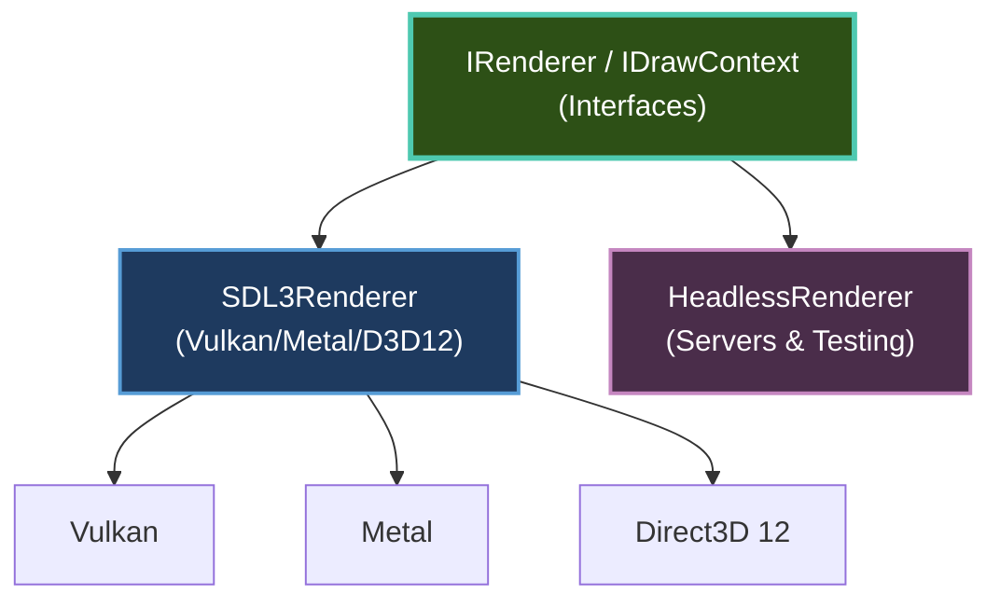
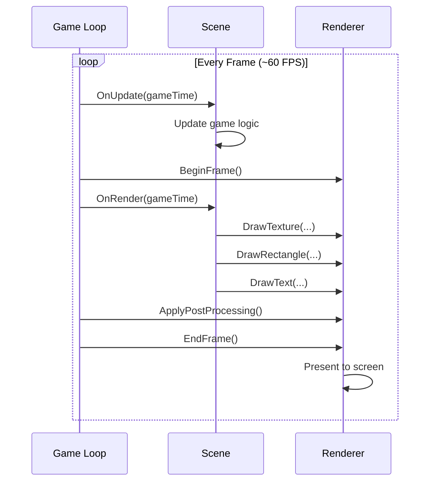

# Rendering

Brine2D's rendering system gives you everything you need for 2D games - from basic sprites to advanced particle systems and post-processing effects.

---

## Quick Start

```csharp
public class RenderingScene : Scene
{
    private ITexture? _playerTexture;

    private readonly IAssetLoader _assets;

    public RenderingScene(IAssetLoader assets) => _assets = assets;

    protected override async Task OnLoadAsync(CancellationToken ct, IProgress<float>? progress = null)
    {
        _playerTexture = await _assets.GetOrLoadTextureAsync("assets/images/player.png", cancellationToken: ct);
    }

    protected override void OnRender(GameTime gameTime)
    {
        // Renderer available automatically!
        Renderer.ClearColor = Color.Black;

        // Draw texture
        if (_playerTexture != null)
        {
            Renderer.DrawTexture(_playerTexture, 100, 100, 64, 64);
        }

        // Draw shapes
        Renderer.DrawRectangleFilled(200, 200, 50, 50, Color.Red);
        Renderer.DrawCircleFilled(300, 300, 25, Color.Blue);

        // Draw text
        Renderer.DrawText("Hello, Brine2D!", 10, 10, Color.White);
    }
}
```

---

## Topics

### Getting Started

| Guide | Description |
|-------|-------------|
| **[Rendering Architecture](choosing-renderer.md)** | Interfaces, GPU drivers, headless mode | ⭐ Beginner |
| **[GPU Renderer](gpu-renderer.md)** | Render targets, scissor rects, blend modes, text | ⭐ Beginner |
| **[Sprites & Textures](sprites.md)** | Load and draw images | ⭐ Beginner |
| **[Drawing Primitives](primitives.md)** | Shapes, lines, and basic graphics | ⭐ Beginner |

### Intermediate

| Guide | Description |
|-------|-------------|
| **[Cameras](cameras.md)** | Camera movement, zoom, and rotation | ⭐⭐ Intermediate |
| **[Texture Atlasing](texture-atlasing.md)** | Optimize draw calls with sprite packing | ⭐⭐ Intermediate |

### Advanced

| Guide | Description |
|-------|-------------|
| **[Particles](particles.md)** | Particle systems for visual effects | ⭐⭐⭐ Advanced |
| **[Post-Processing](post-processing.md)** | Off-screen rendering and effects | ⭐⭐⭐ Advanced |

---

## Key Concepts

### Renderer Architecture

Brine2D has a single GPU-accelerated renderer built on the SDL3 GPU API:



[:octicons-arrow-right-24: Learn more in Rendering Architecture](choosing-renderer.md)

---

### Render Loop

Understanding the render loop:



**Pattern:** Update game state, then render. The framework manages `BeginFrame` / `EndFrame` automatically.

---

### Framework Property

The `Renderer` property is **automatically set** by the framework:

```csharp
public class GameScene : Scene
{
    // ✅ No injection needed!
    // Renderer is a framework property

    protected override void OnRender(GameTime gameTime)
    {
        // Renderer available automatically
        Renderer.ClearColor = Color.Black;
        Renderer.DrawText("Hello!", 10, 10, Color.White);
    }
}
```

**Pattern:** Matches ASP.NET's `ControllerBase.Request` - framework-provided properties you don't inject.

---

## Common Tasks

### Draw a Sprite

```csharp
private ITexture? _sprite;

protected override async Task OnLoadAsync(CancellationToken ct, IProgress<float>? progress = null)
{
    _sprite = await _assets.GetOrLoadTextureAsync("assets/sprite.png", cancellationToken: ct);
}

protected override void OnRender(GameTime gameTime)
{
    if (_sprite != null)
    {
        Renderer.DrawTexture(_sprite, x: 100, y: 100, width: 64, height: 64);
    }
}
```

[:octicons-arrow-right-24: Full guide: Sprites & Textures](sprites.md)

---

### Draw Shapes

```csharp
protected override void OnRender(GameTime gameTime)
{
    // Filled rectangle
    Renderer.DrawRectangleFilled(100, 100, 50, 50, Color.Red);

    // Circle outline
    Renderer.DrawCircleOutline(200, 200, 25, Color.Blue);

    // Line
    Renderer.DrawLine(300, 300, 400, 400, Color.Green, thickness: 2);
}
```

[:octicons-arrow-right-24: Full guide: Drawing Primitives](primitives.md)

---

### Camera Movement

```csharp
private Camera2D _camera = new();

protected override void OnUpdate(GameTime gameTime)
{
    // Follow player
    _camera.Position = _playerPosition;
    _camera.Zoom = 2.0f;

    // Apply camera transform
    Renderer.Camera = _camera;
}

protected override void OnRender(GameTime gameTime)
{
    // All drawing now relative to camera
    Renderer.DrawTexture(_worldTexture, 0, 0);
}
```

[:octicons-arrow-right-24: Full guide: Cameras](cameras.md)

---

### Particle Effects

```csharp
var entity = World.CreateEntity("ParticleEmitter");
var emitter = entity.AddComponent<ParticleEmitterComponent>();

emitter.EmissionRate = 100f;
emitter.ParticleLifetime = 2f;
emitter.StartColor = new Color(255, 200, 0, 255);  // Orange
emitter.EndColor = new Color(255, 50, 0, 0);       // Fade to transparent
emitter.EmitterShape = EmitterShape.Cone;
emitter.BlendMode = BlendMode.Additive;  // Fire effect
```

[:octicons-arrow-right-24: Full guide: Particles](particles.md)

---

### Texture Atlasing

```csharp
// Load individual textures
var textures = new List<ITexture>();
for (int i = 0; i < 10; i++)
{
    textures.Add(await _assets.GetOrLoadTextureAsync($"assets/sprite{i}.png", cancellationToken: ct));
}

// Build atlas at runtime
var atlas = await AtlasBuilder.BuildAtlasAsync(
    Renderer,
    textures,
    padding: 2,
    maxSize: 2048
);

// Draw using atlas (1 draw call instead of 10!)
var region = atlas.GetRegion(textures[0]);
Renderer.DrawTexture(atlas.AtlasTexture, region.SourceRect, destRect);
```

[:octicons-arrow-right-24: Full guide: Texture Atlasing](texture-atlasing.md)

---

## Performance Tips

### Reduce Draw Calls

**Problem:** Each texture switch is expensive.

**Solution:** Use texture atlasing to batch sprites.

```csharp
// ❌ Bad - each sprite may use a different texture, causing many draw calls
for (int i = 0; i < 100; i++)
{
    Renderer.DrawTexture(_sprites[i], x[i], y[i]);
}

// ✅ Good - all sprites in one atlas, batched automatically
var atlas = await AtlasBuilder.BuildAtlasAsync(Renderer, sprites);
Renderer.DrawTexture(atlas.AtlasTexture, ...); // Batched!
```

[:octicons-arrow-right-24: Learn more: Texture Atlasing](texture-atlasing.md)

---

### Minimize Texture Loads

**Problem:** Loading textures is slow.

**Solution:** Load once in `OnLoadAsync`, cache references, or use `AssetManifest` for parallel loading.

```csharp
// ✅ Good - load once
private ITexture? _sprite;

protected override async Task OnLoadAsync(CancellationToken ct, IProgress<float>? progress = null)
{
    _sprite = await _assets.GetOrLoadTextureAsync("assets/sprite.png", cancellationToken: ct);
}

protected override void OnRender(GameTime gameTime)
{
    Renderer.DrawTexture(_sprite, ...);  // Use cached texture
}

// ❌ Bad - loads every frame!
protected override void OnRender(GameTime gameTime)
{
    var tex = await _assets.GetOrLoadTextureAsync("assets/sprite.png");  // NO!
    Renderer.DrawTexture(sprite, ...);
}
```

---

### Monitor Performance

Use built-in performance monitoring:


```

**Press F3** to toggle overlay showing:
- FPS
- Frame time
- Draw calls
- Memory usage

[:octicons-arrow-right-24: Learn more: Performance Monitoring](../performance/monitoring.md)

---

## Best Practices

### ✅ DO

1. **Load textures in `OnLoadAsync`** - keep `OnRender` fast
2. **Use texture atlasing** - batch sprites that render together
3. **Set `ClearColor` once** - don't change every frame
4. **Cache texture references** - don't reload textures
5. **Use `AssetManifest`** - parallel loading with ref counting

```csharp
// ✅ Good pattern
protected override async Task OnLoadAsync(CancellationToken ct, IProgress<float>? progress = null)
{
    await _assets.PreloadAsync(_manifest, cancellationToken: ct);
}

protected override void OnRender(GameTime gameTime)
{
    Renderer.ClearColor = Color.Black;
    Renderer.DrawTexture(_manifest.Background, 0, 0);
}
```

---

### ❌ DON'T

1. **Don't inject `IRenderer`** - use the `Renderer` framework property
2. **Don't load assets in `OnRender`** - causes lag
3. **Don't change `ClearColor` every frame** - unnecessary
4. **Don't draw thousands of individual sprites** - use atlasing

```csharp
// ❌ Bad pattern
protected override void OnRender(GameTime gameTime)
{
    // Don't load in render!
    var sprite = await _assets.GetOrLoadTextureAsync("sprite.png");  // NO!

    // Don't draw many individual sprites without atlasing
    for (int i = 0; i < 1000; i++)
    {
        Renderer.DrawTexture(_sprites[i], ...);  // Use atlas instead!
    }
}
```

---

## Troubleshooting

### "Texture is null" Error

**Symptom:** `NullReferenceException` when drawing.

**Solution:** Ensure the texture loaded successfully in `OnLoadAsync`.

```csharp
protected override void OnRender(GameTime gameTime)
{
    if (_sprite != null)  // Always check!
    {
        Renderer.DrawTexture(_sprite, 100, 100);
    }
}
```

---

### Nothing Renders (Black Screen)

**Checklist:**

1. ✅ Is `OnRender()` being called? (Add logger)
2. ✅ Is texture loaded? (Check `_sprite != null`)
3. ✅ Are coordinates on screen? (Try `x=0, y=0`)
4. ✅ Is texture size non-zero? (Check `Width`, `Height`)
5. ✅ Is alpha > 0? (Check color alpha channel)

```csharp
protected override void OnRender(GameTime gameTime)
{
    Logger.LogDebug("OnRender called");

    if (_sprite == null)
    {
        Logger.LogWarning("Sprite is null!");
        return;
    }

    // Draw at 0,0 to test
    Renderer.DrawTexture(_sprite, 0, 0, 64, 64);
}
```

---

### Poor Performance

**Check:**

1. **Draw call count** - Press F3 to see overlay
   - Goal: < 100 draw calls per frame
   - Solution: Use texture atlasing

2. **FPS** - Should be 60 (or monitor refresh rate)
   - If low: Profile with performance monitor
   - Solution: Reduce draw calls

3. **Memory usage** - Check for texture leaks
   - Solution: Use `AssetManifest` for automatic lifecycle management

[:octicons-arrow-right-24: Performance Guide](../performance/optimization.md)

---

## Related Topics

- [Sprites & Textures](sprites.md) - Load and draw images
- [Cameras](cameras.md) - Camera movement and zoom
- [Performance Optimization](../performance/optimization.md) - Improve rendering speed
- [Fundamentals: Architecture](../fundamentals/architecture.md) - Understand rendering architecture

---

**Ready to render?** Start with [Sprites & Textures](sprites.md)!
