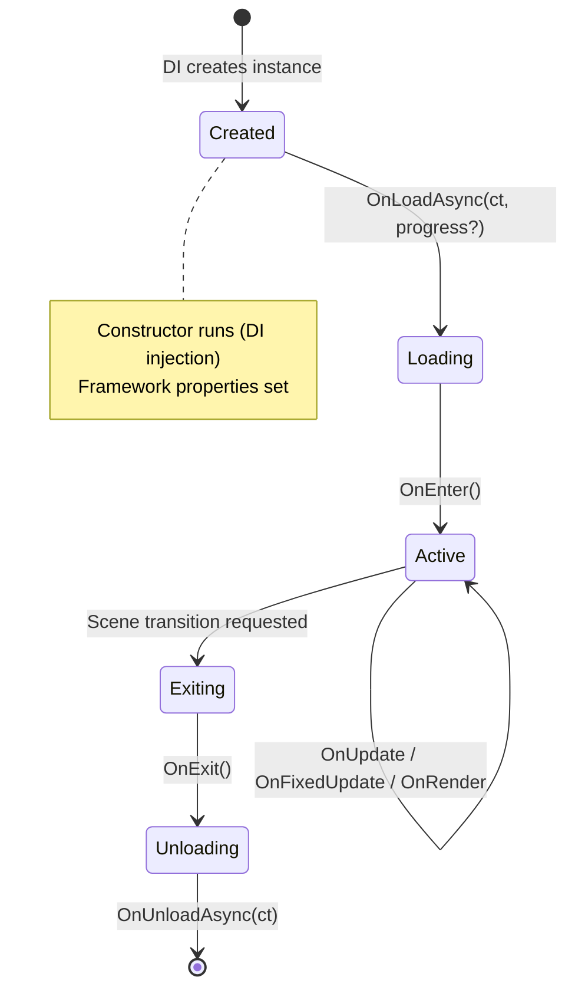

# Scenes

Scenes are the building blocks of your game. Each scene represents a distinct state or screen - menu, gameplay, pause, game over, etc. Think of them like **ASP.NET Controllers**: each one handles a specific part of your application.

---

## Scene Types

| Base Class | Has World (ECS) | Use For |
|-----------|:---------------:|---------|
| `Scene` | :white_check_mark: Yes | Gameplay scenes with entities |
| `SceneBase` | :x: No | Lightweight scenes (menus, splash) |
| `LoadingScene` | :x: No | Loading screen display |

---

## Lifecycle

Every scene goes through a predictable lifecycle:



### Lifecycle Methods

| Phase | Method | Purpose | Thread |
|-------|--------|---------|--------|
| **1. Constructor** | `ctor(services)` | Receive YOUR dependencies via DI | Main |
| **2. Load** | `OnLoadAsync(ct, progress?)` | Load assets, create queries | Background-safe |
| **3. Enter** | `OnEnter()` | Initialize state, create entities, start music | Main |
| **4. Update** | `OnUpdate(gameTime)` | Game logic, input handling | Main |
| **4b. FixedUpdate** | `OnFixedUpdate(fixedTime)` | Deterministic simulation (0+ times/frame) | Main |
| **4c. Render** | `OnRender(gameTime)` | Draw overlays/HUD (after ECS renders) | Main |
| **5. Exit** | `OnExit()` | Main-thread cleanup (stop audio, etc.) | Main |
| **6. Unload** | `OnUnloadAsync(ct)` | Async cleanup | Background |

---

### Framework Properties

Six properties are set automatically by the engine before `OnLoadAsync`:

| Property | Type | Description |
|----------|------|-------------|
| `Logger` | `ILogger` | Structured logging |
| `Renderer` | `IRenderer` | Drawing API |
| `Input` | `IInputContext` | Keyboard, mouse, gamepad |
| `Audio` | `IAudioPlayer` | Sound and music playback |
| `Game` | `IGameContext` | GameTime, RequestExit |
| `World` | `IEntityWorld` | ECS (`Scene` only, not `SceneBase`) |

**Availability:**

| Property | Constructor | OnLoadAsync | OnEnter | OnUpdate/Render | OnExit | OnUnloadAsync |
|----------|:-----------:|:-----------:|:-------:|:---------------:|:------:|:-------------:|
| `Logger` | :x: | :white_check_mark: | :white_check_mark: | :white_check_mark: | :white_check_mark: | :white_check_mark: |
| `World` | :x: | :white_check_mark: | :white_check_mark: | :white_check_mark: | :white_check_mark: | :x: |
| `Renderer` | :x: | :white_check_mark: | :white_check_mark: | :white_check_mark: | :white_check_mark: | :x: |
| `Input` | :x: | :white_check_mark: | :white_check_mark: | :white_check_mark: | :white_check_mark: | :x: |
| `Audio` | :x: | :white_check_mark: | :white_check_mark: | :white_check_mark: | :white_check_mark: | :x: |
| `Game` | :x: | :white_check_mark: | :white_check_mark: | :white_check_mark: | :white_check_mark: | :white_check_mark: |

!!! warning
    Accessing framework properties in the constructor throws `InvalidOperationException`. Use `OnLoadAsync` or `OnEnter`.

---

### What's Automatic

The `SceneManager` handles frame management and ECS execution automatically each frame:

1. Calls `scene.OnUpdate(gameTime)`
2. Calls `world.Update(gameTime)` - runs all update systems, then behaviors
3. Calls `scene.OnFixedUpdate(fixedTime)` zero or more times
4. Calls `world.FixedUpdate(fixedTime)` for each fixed step
5. Manages `BeginFrame`/`EndFrame`
6. Calls `world.Render(renderer)` - runs all render systems, then behaviors
7. Calls `scene.OnRender(gameTime)` - your overlays on top

**You never call:** `world.Update()`, `world.Render()`, `renderer.BeginFrame()`, `renderer.EndFrame()`

---

## Scene Registration

```csharp
builder.AddScene<MenuScene>();
builder.AddScene<GameScene>();

// Or fluent
builder.AddScenes(scenes => scenes
    .Add<MenuScene>()
    .Add<GameScene>());
```

---

## Scene Transitions

```csharp
// Simple transition
_sceneManager.LoadScene<GameScene>();

// With fade transition
_sceneManager.LoadScene<GameScene>(new FadeTransition(duration: 0.5f));

// With loading screen
_sceneManager.LoadScene<GameScene, CustomLoadingScreen>(
    new FadeTransition(duration: 0.5f));
```

`LoadScene` is **fire-and-forget** (void). It queues a transition for the end of the current frame.

[:octicons-arrow-right-24: Full guide: Scene Transitions](transitions.md)

---

## Complete Example

```csharp
public class GameScene : Scene
{
    private readonly IAssetLoader _assets;
    private readonly ISceneManager _sceneManager;

    public GameScene(IAssetLoader assets, ISceneManager sceneManager)
    {
        _assets = assets;
        _sceneManager = sceneManager;
    }

    protected override async Task OnLoadAsync(CancellationToken ct, IProgress<float>? progress = null)
    {
        Logger.LogInformation("Loading game assets...");
        _texture = await _assets.GetOrLoadTextureAsync("assets/images/player.png", cancellationToken: ct);
    }

    protected override void OnEnter()
    {
        var player = World.CreateEntity("Player");
        player.AddComponent<TransformComponent>().Position = new Vector2(400, 300);
        Audio.PlayMusic(_bgMusic);
    }

    protected override void OnUpdate(GameTime gameTime)
    {
        if (Input.IsKeyPressed(Key.Escape))
            _sceneManager.LoadScene<MenuScene>();
    }

    protected override void OnRender(GameTime gameTime)
    {
        Renderer.DrawText("Score: " + _score, 10, 10, Color.White);
    }

    protected override void OnExit()
    {
        Audio.StopMusic();
    }

    protected override Task OnUnloadAsync(CancellationToken ct)
    {
        // World cleanup is automatic!
        return Task.CompletedTask;
    }
}
```

---

## Common Patterns

### Loading Screen Progress

```csharp
protected override async Task OnLoadAsync(CancellationToken ct, IProgress<float>? progress = null)
{
    _texture = await _assets.GetOrLoadTextureAsync("assets/images/player.png", cancellationToken: ct);
    progress?.Report(0.5f);

    _music = await _assets.GetOrLoadMusicAsync("assets/audio/theme.ogg", ct);
    progress?.Report(1.0f);
}
```

### Asset Manifest Preloading

```csharp
public class LevelAssets : AssetManifest
{
    public readonly AssetRef<ITexture>     Player = Texture("assets/images/player.png");
    public readonly AssetRef<ISoundEffect> Jump   = Sound("assets/audio/jump.wav");
    public readonly AssetRef<IMusic>       Theme  = Music("assets/audio/theme.ogg");
    public readonly AssetRef<IFont>        HUD    = Font("assets/fonts/ui.ttf", size: 20);
}

private readonly LevelAssets _manifest = new();

protected override async Task OnLoadAsync(CancellationToken ct, IProgress<float>? progress = null)
{
    await _assets.PreloadAsync(_manifest, cancellationToken: ct);
}

protected override void OnEnter()
{
    var sprite = World.CreateEntity("Player").AddComponent<SpriteComponent>();
    sprite.Texture = _manifest.Player; // Implicit conversion
}
```

### Shared State Between Scenes

```csharp
public class GameState
{
    public int Score { get; set; }
    public int Level { get; set; }
}

// Register as singleton in Program.cs
builder.Services.AddSingleton<GameState>();

// Inject in any scene
public GameScene(GameState gameState) => _gameState = gameState;
```

---

## Best Practices

### :white_check_mark: DO

1. **Load assets in OnLoadAsync** - use `IAssetLoader` with async/await
2. **Create entities in OnEnter** - after assets are loaded
3. **Use framework properties** - Logger, World, Renderer, Input, Audio, Game
4. **Use OnExit for main-thread cleanup** - stop audio, release SDL resources
5. **Use singleton services** - for data that persists between scenes

### :x: DON'T

1. **Don't access framework properties in constructor** - they're not set yet
2. **Don't create entities in constructor** - World not available
3. **Don't manually clear World** - automatic on scene unload
4. **Don't access Renderer/Input/Audio in OnUnloadAsync** - use OnExit instead
5. **Don't call World.Update or Renderer.BeginFrame** - automatic

---

## Troubleshooting

### NullReferenceException on Logger/World/Renderer

Use lifecycle methods, not the constructor:

```csharp
// ❌ Wrong
public GameScene() { Logger.LogInformation("Created"); }

// ✅ Correct
protected override void OnEnter() { Logger.LogInformation("Scene entered"); }
```

### Scene Doesn't Load

1. Scene registered? `builder.AddScene<GameScene>();`
2. Public constructor?
3. All constructor parameters resolvable by DI?

---

## Related Topics

- [Scene Transitions](transitions.md) - Smooth scene changes and loading screens
- [ECS](../ecs/index.md) - Entity Component System
- [Assets](../assets/index.md) - Asset loading and manifests