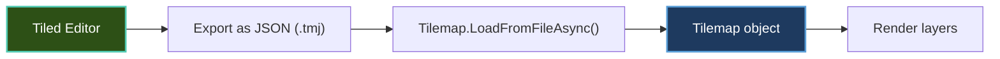

# Tilemaps

Learn how to use tilemaps from Tiled editor to create levels and worlds for your Brine2D games.

---

## Quick Start

```csharp
using Brine2D.Tilemap;

public class TilemapScene : Scene
{
    private Tilemap? _tilemap;
    
    protected override async Task OnLoadAsync(CancellationToken ct)
    {
        // Load tilemap from Tiled JSON
        _tilemap = await Tilemap.LoadFromFileAsync("assets/level1.tmj", ct);
        
        Logger.LogInformation("Loaded tilemap: {Width}x{Height} tiles", 
            _tilemap.Width, _tilemap.Height);
    }
    
    protected override void OnRender(GameTime gameTime)
    {
        if (_tilemap != null)
        {
            // Render all layers
            _tilemap.Render(Renderer);
        }
    }
}
```

---

## Topics

| Guide | Description |
|---|---|
| **[Loading Tilemaps](loading.md)** | Load tilemaps from Tiled JSON format|
| **[Rendering Tiles](rendering.md)** | Render tilemap layers efficiently|

---

## Key Concepts

### Tiled Integration

Brine2D supports **Tiled Map Editor** (.tmj JSON format):



**Download Tiled:** [mapeditor.org](https://www.mapeditor.org/)

[:octicons-arrow-right-24: Learn more: Loading Tilemaps](loading.md)

---

### Tilemap Structure

A tilemap consists of:

| Component | Description |
|-----------|-------------|
| **Tileset** | Collection of tiles (spritesheet) |
| **Layers** | Multiple rendering layers (background, foreground, collision) |
| **Tiles** | Individual tile references (by ID) |
| **Properties** | Custom metadata per tile/layer |

```csharp
// Tilemap structure
var tilemap = await Tilemap.LoadFromFileAsync("level.tmj");

Logger.LogInformation("Map size: {W}x{H} tiles", tilemap.Width, tilemap.Height);
Logger.LogInformation("Tile size: {TW}x{TH} pixels", tilemap.TileWidth, tilemap.TileHeight);
Logger.LogInformation("Layers: {Count}", tilemap.Layers.Count);
```

---

## Common Tasks

### Load Tilemap

```csharp
protected override async Task OnLoadAsync(CancellationToken ct)
{
    // Load from Tiled JSON format
    _tilemap = await Tilemap.LoadFromFileAsync("assets/maps/level1.tmj", ct);
    
    // Verify loaded
    if (_tilemap == null)
    {
        Logger.LogError("Failed to load tilemap");
        return;
    }
    
    Logger.LogInformation("Loaded {Layers} layers", _tilemap.Layers.Count);
}
```

[:octicons-arrow-right-24: Full guide: Loading Tilemaps](loading.md)

---

### Render Tilemap

```csharp
protected override void OnRender(GameTime gameTime)
{
    if (_tilemap != null)
    {
        // Render all layers
        _tilemap.Render(Renderer);
        
        // Or render specific layer
        var backgroundLayer = _tilemap.GetLayer("Background");
        backgroundLayer?.Render(Renderer);
    }
}
```

[:octicons-arrow-right-24: Full guide: Rendering Tiles](rendering.md)

---

### Tilemap Collision

```csharp
protected override Task OnLoadAsync(CancellationToken ct)
{
    // Get collision layer
    var collisionLayer = _tilemap.GetLayer("Collision");
    
    // Create colliders from tiles
    for (int y = 0; y < collisionLayer.Height; y++)
    {
        for (int x = 0; x < collisionLayer.Width; x++)
        {
            var tileId = collisionLayer.GetTile(x, y);
            
            if (tileId > 0)  // Tile exists (non-empty)
            {
                // Create collider for solid tile
                var collider = new BoxCollider(
                    x * _tilemap.TileWidth,
                    y * _tilemap.TileHeight,
                    _tilemap.TileWidth,
                    _tilemap.TileHeight
                );
                
                _collisionSystem.Register(collider);
            }
        }
    }
    
    return Task.CompletedTask;
}
```

---

### Camera with Tilemap

```csharp
private Camera2D _camera = new();

protected override void OnUpdate(GameTime gameTime)
{
    // Follow player
    _camera.Position = _playerPosition;
    
    // Clamp camera to tilemap bounds
    var mapWidth = _tilemap.Width * _tilemap.TileWidth;
    var mapHeight = _tilemap.Height * _tilemap.TileHeight;
    
    _camera.Position.X = Math.Clamp(_camera.Position.X, 0, mapWidth - 800);
    _camera.Position.Y = Math.Clamp(_camera.Position.Y, 0, mapHeight - 600);
    
    // Apply camera
    Renderer.Camera = _camera;
}
```

---

### Layer Management

```csharp
// Render layers in specific order
protected override void OnRender(GameTime gameTime)
{
    // Background first
    var bgLayer = _tilemap.GetLayer("Background");
    bgLayer?.Render(Renderer);
    
    // Draw game objects (player, enemies)
    DrawGameObjects();
    
    // Foreground last (overlays player)
    var fgLayer = _tilemap.GetLayer("Foreground");
    fgLayer?.Render(Renderer);
}
```

---

## Tiled Editor Workflow

### 1. Create Tilemap in Tiled

1. Open Tiled Editor
2. **File → New → New Map**
   - Orientation: Orthogonal
   - Tile size: 16x16 (or your tile size)
   - Map size: 50x50 tiles (or your map size)

3. **Map → New Tileset**
   - Load your tileset image
   - Set tile dimensions

4. Paint tiles on layers
5. **File → Export As... → JSON (.tmj)**

---

### 2. Organize Layers

**Recommended layer structure:**

| Layer | Purpose |
|-------|---------|
| **Background** | Static background tiles |
| **Ground** | Main walkable terrain |
| **Decoration** | Non-colliding decorations |
| **Collision** | Invisible collision tiles |
| **Foreground** | Objects in front of player |

---

### 3. Add Custom Properties

```csharp
// In Tiled: Select tile → Add custom property
// Property: "damage" = 10

// In Brine2D: Read property
var tile = layer.GetTile(x, y);
if (tile.HasProperty("damage"))
{
    var damage = tile.GetProperty<int>("damage");
    _playerHealth -= damage;
}
```

---

## Performance Tips

### Use Texture Atlasing

```csharp
// Tilesets are automatically atlased
// Each tileset = 1 draw call per layer
// Much faster than individual sprites
```

---

### Cull Off-Screen Tiles

```csharp
// Only render visible tiles
var camera = Renderer.Camera;
var viewport = new Rectangle(
    (int)camera.Position.X,
    (int)camera.Position.Y,
    800,  // Screen width
    600   // Screen height
);

_tilemap.RenderViewport(Renderer, viewport);
```

---

### Cache Layer Renders

```csharp
// For static layers, render to texture once
private ITexture? _backgroundTexture;

protected override async Task OnLoadAsync(CancellationToken ct)
{
    // Render background layer to texture
    _backgroundTexture = _tilemap.RenderLayerToTexture("Background", Renderer);
}

protected override void OnRender(GameTime gameTime)
{
    // Draw cached texture (much faster!)
    Renderer.DrawTexture(_backgroundTexture, 0, 0);
}
```

---

## Best Practices

### ✅ DO

1. **Use Tiled for level design** - Visual editor is faster
2. **Organize layers logically** - Background, ground, collision, foreground
3. **Export as JSON (.tmj)** - Brine2D's supported format
4. **Use collision layer** - Separate from visual tiles
5. **Add custom properties** - Store metadata in Tiled

```csharp
// ✅ Good layer organization
var bg = _tilemap.GetLayer("Background");
var ground = _tilemap.GetLayer("Ground");
var collision = _tilemap.GetLayer("Collision");
var fg = _tilemap.GetLayer("Foreground");
```

---

### ❌ DON'T

1. **Don't create tilemaps manually** - Use Tiled editor
2. **Don't render every tile** - Cull off-screen tiles
3. **Don't load huge tilemaps** - Split into chunks
4. **Don't ignore layer order** - Background before foreground
5. **Don't forget to export as JSON** - Not .tmx XML

```csharp
// ❌ Bad - rendering all tiles every frame
for (int y = 0; y < _tilemap.Height; y++)
{
    for (int x = 0; x < _tilemap.Width; x++)
    {
        // Renders off-screen tiles too - slow!
    }
}
```

---

## Troubleshooting

### Tilemap Not Loading

**Symptom:** `LoadFromFileAsync()` returns null

**Solutions:**

1. **Check file exists:**

```csharp
if (!File.Exists("assets/maps/level1.tmj"))
{
    Logger.LogError("Tilemap file not found");
}
```

2. **Verify file format:**
   - Must be JSON (.tmj), not XML (.tmx)
   - In Tiled: **File → Export As... → JSON**

3. **Check tileset paths:**
   - Tileset images must be in correct relative path
   - Check paths in .tmj file

---

### Tiles Not Rendering

**Symptom:** Black screen or missing tiles

**Solutions:**

1. **Verify layer exists:**

```csharp
var layer = _tilemap.GetLayer("Background");
if (layer == null)
{
    Logger.LogWarning("Layer 'Background' not found");
}
```

2. **Check tile IDs:**

```csharp
var tileId = layer.GetTile(x, y);
Logger.LogDebug("Tile at ({X},{Y}): ID={ID}", x, y, tileId);
```

3. **Verify tileset loaded:**

```csharp
if (_tilemap.Tilesets.Count == 0)
{
    Logger.LogError("No tilesets loaded");
}
```

---

### Performance Issues

**Symptom:** Low FPS with tilemaps

**Solutions:**

1. **Enable culling:**

```csharp
// Only render visible tiles
_tilemap.RenderViewport(Renderer, cameraViewport);
```

2. **Reduce map size:**
   - Split large maps into chunks
   - Load/unload chunks as player moves

3. **Cache static layers:**

```csharp
// Render to texture once
_cachedBackground = _tilemap.RenderLayerToTexture("Background");
```

---

## File Structure

```
YourGame/
├── assets/
│   ├── maps/
│   │   ├── level1.tmj         # Tiled JSON map
│   │   └── level2.tmj
│   └── tilesets/
│       ├── terrain.png        # Tileset spritesheet
│       └── objects.png
```

**In `.csproj`:**

```xml
<ItemGroup>
  <None Update="assets\**\*">
    <CopyToOutputDirectory>PreserveNewest</CopyToOutputDirectory>
  </None>
</ItemGroup>
```

---

## Related Topics

- [Loading Tilemaps](loading.md) - Load from Tiled
- [Rendering Tiles](rendering.md) - Efficient rendering
- [Tutorials: Building a Platformer](../tutorials/platformer.md) - Tilemap example
- [Cameras](../rendering/cameras.md) - Camera with tilemaps
- [Collision Detection](../collision/index.md) - Tilemap collision

---

## External Resources

- [Tiled Map Editor](https://www.mapeditor.org/) - Download Tiled
- [Tiled Documentation](https://doc.mapeditor.org/) - Tiled manual
- [Tiled Tutorials](https://www.gamefromscratch.com/tiled-map-editor-tutorial-series/) - Video tutorials

---

**Ready to build levels?** Start with [Loading Tilemaps](loading.md)!
