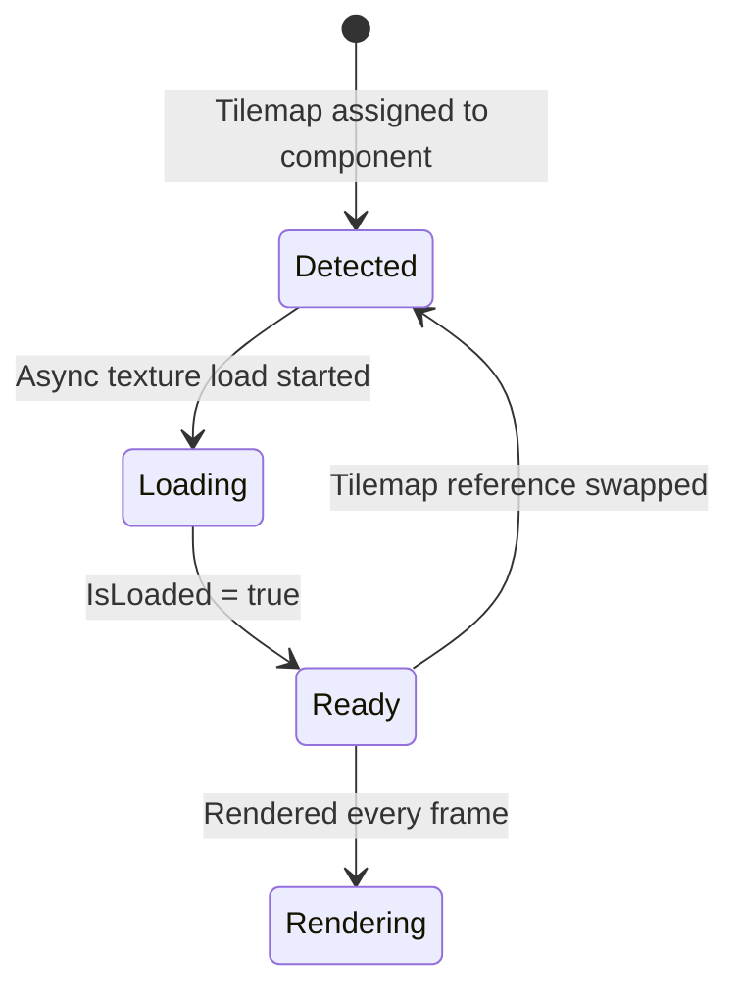

---
title: Rendering Tilemaps
description: Render tile layers, handle parallax, and position tilemaps in Brine2D
---

# Rendering Tilemaps

`TilemapSystem` handles all tile rendering automatically once you've added the system and a `TilemapComponent` to your world. This page covers how the rendering pipeline works, how to control positioning and parallax, and how to handle image layers.

---

## How It Works

`TilemapSystem` is an ECS system that runs every frame. It:

1. Detects when a `TilemapComponent.Tilemap` is set or swapped
2. Initializes a `TilemapAnimator` for that map
3. Kicks off an **async texture load** for all tilesets in the background
4. Sets `IsLoaded = true` once textures are ready
5. Renders all visible tile layers each frame (skips the component until `IsLoaded`)



---

## Registering the System

Add `TilemapSystem` in `OnEnter`. It requires `ITextureLoader` (provided by the engine) and optionally an `ICamera`:

```csharp
protected override void OnEnter()
{
    World.AddSystem<TilemapSystem>();
}
```

`TilemapSystem` is registered as transient by `AddTilemapServices()`, so the DI container resolves it with the correct dependencies automatically.

---

## IsLoaded

Tile layers aren't visible until textures have finished loading. You can gate other initialization on this if needed:

```csharp
protected override void OnUpdate(GameTime gameTime)
{
    var component = World.Query<TilemapComponent>().FirstOrDefault();
    if (component?.IsLoaded == true)
    {
        // Safe to generate collision rects, query objects, etc.
    }
}
```

!!! note
    Most use cases don't need to check `IsLoaded` directly. Collision rects and object queries work off the `Tilemap` data model, which is populated the moment `LoadAsync` returns — before textures are ready.

---

## Positioning the Map

Use `PositionOffset` on the component to shift the entire map in world space without modifying layer offsets:

```csharp
World.CreateEntity()
    .AddComponent<TilemapComponent>(c =>
    {
        c.Tilemap = tilemap;
        c.PositionOffset = new Vector2(128, 0); // shift 128px right
    });
```

Individual layers also have `OffsetX`/`OffsetY`, which come from Tiled's layer offset settings.

---

## Parallax

Parallax is set per-layer in Tiled (**Layer Properties → Parallax**). The renderer uses it automatically when a camera is provided.

A parallax of `1.0` (default) scrolls with the camera normally. Values below `1.0` scroll slower, creating a background depth effect. `0.0` pins the layer to the screen.

```
parallaxShift = camera.Position * (1.0 - layer.Parallax)
tileWorldX = tile.X + layer.OffsetX + positionOffset.X + parallaxShiftX
```

!!! warning "Collision and parallax"
    Don't use parallax on collision layers. `GenerateCollisionRects` does not apply parallax, so physics bodies won't match visuals if the collision layer scrolls at a different rate.

---

## Layer Order

Layers are drawn in document order from Tiled, which maps to ascending `ZOrder` values assigned at load time. Tile layers and image layers share the same counter, so a tile layer at position 3 and an image layer at position 4 are drawn in that order.

To draw game objects between layers, check `ZOrder` on the layers you care about and render at the matching depth in your `OnRender` override.

---

## Image Layers

Image layers (full-image backgrounds and foregrounds) are **not rendered automatically**. `TilemapSystem` only draws tile layers.

To render an image layer, load the image yourself and draw it using the layer's parallax and offset values:

```csharp
// In OnLoadAsync:
var skyLayer = tilemap.GetImageLayer("Sky");
if (skyLayer != null)
    _skyTexture = await _assets.GetOrLoadTextureAsync(skyLayer.ImagePath, cancellationToken: ct);
```

```csharp
// In OnRender:
if (_skyTexture != null && _skyLayer != null)
{
    var parallaxX = _skyLayer.ParallaxX;
    var parallaxY = _skyLayer.ParallaxY;
    var shiftX = camera.Position.X * (1f - parallaxX);
    var shiftY = camera.Position.Y * (1f - parallaxY);

    Renderer.DrawTexture(
        _skyTexture,
        _skyLayer.OffsetX + shiftX,
        _skyLayer.OffsetY + shiftY);
}
```

---

## Tile Animation

Animated tiles are driven automatically by `TilemapAnimator`. You don't need to do anything — if your tileset has animated tiles defined in Tiled, they animate correctly. All instances of the same tile share one clock, matching Tiled's behavior.

---

## Tile Flipping

Tiles flipped in Tiled (horizontal, vertical, diagonal/rotation) are rendered correctly. The diagonal flip encodes 90° rotations in Tiled's format and is handled automatically.

---

## Related Topics

- [Loading Tilemaps](loading.md) — load a `.tmj` and create the component
- [Collision & Objects](collision-and-objects.md) — generate collision rects, query objects
- [ECS: Systems](../ecs/systems.md) — system registration and update order
- [Cameras](../rendering/cameras.md) — passing a camera to `TilemapSystem`
